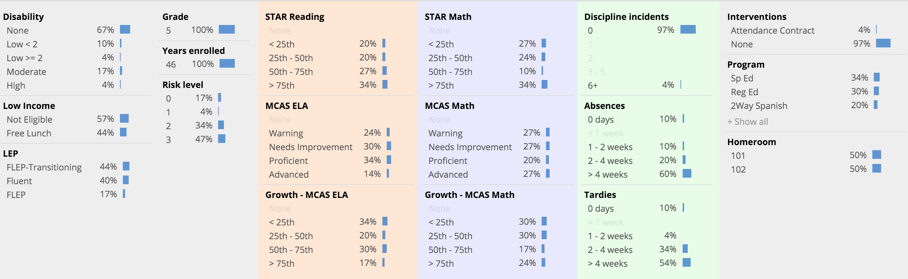
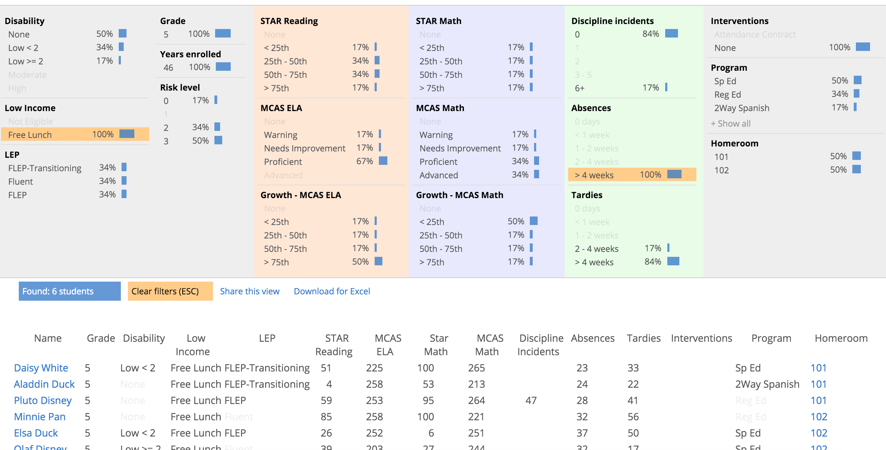
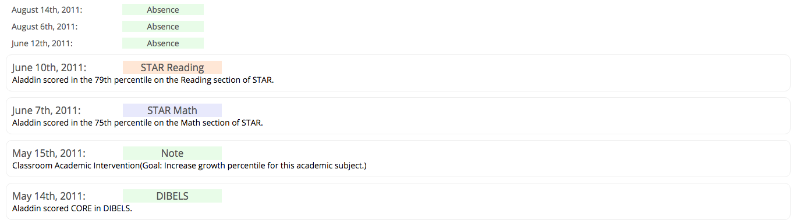
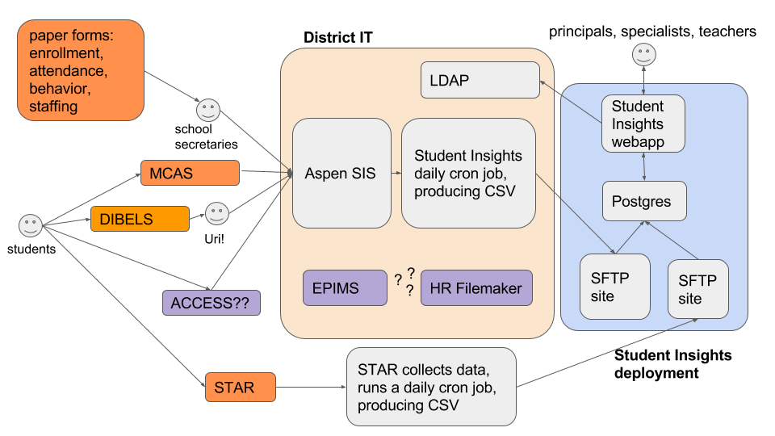
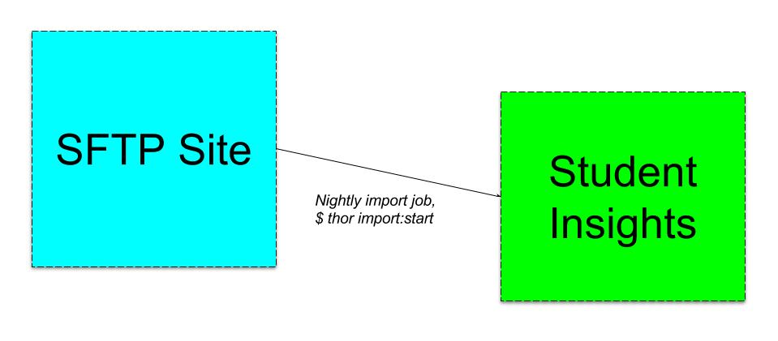

# Student Insights

[](https://travis-ci.org/studentinsights/studentinsights)
[](https://codeclimate.com/github/studentinsights/studentinsights)

Student Insights gives educators an overview of student progress at their school, classroom-level rosters and individual student profiles.  It also allows them to capture interventions and notes during weekly or bi-weekly student support meetings focused on the most at-risk students.

Check out the [demo site](https://somerville-teacher-tool-demo.herokuapp.com/) with different roles:

  - District admin: `uri@demo.studentinsights.org`
  - K8 principal: `laura@demo.studentinsights.org`
  - Kindergarten teacher: `vivian@demo.studentinsights.org`
  - HS physics teacher: `hugo@demo.studentinsights.org`
  - 9th grade counselor: `sofia@demo.studentinsights.org`

All accounts use the password: `demo-password`.

Our presentation at [Code for Boston demo night](docs/readme_images/Student%20Insights%20-%20Demo%20Night%20slides.pdf) in May 2016 also has a good product overview.

<!-- UPDATE WITH DOCTOC: $ doctoc README.md -->

<!-- START doctoc generated TOC please keep comment here to allow auto update -->
<!-- DON'T EDIT THIS SECTION, INSTEAD RE-RUN doctoc TO UPDATE -->
# Table of Contents

- [User personas: Who we're serving](#user-personas-who-were-serving)
- [Product overview: How we're helping](#product-overview-how-were-helping)
  - [School overview](#school-overview)
  - [Classroom rosters](#classroom-rosters)
  - [Student profiles](#student-profiles)
    - [Capturing meeting notes and interventions](#capturing-meeting-notes-and-interventions)
- [Contributing](#contributing)
- [How it works](#how-it-works)
  - [Admin dashboard](#admin-dashboard)
- [Development Environment](#development-environment)
  - [1. Install dependencies](#1-install-dependencies)
  - [2. Create database tables and seed them with demo data](#2-create-database-tables-and-seed-them-with-demo-data)
  - [3. Start the app](#3-start-the-app)
  - [4. Run the tests](#4-run-the-tests)
  - [5. Write code!](#5-write-code)
  - [6. Use the product locally](#6-use-the-product-locally)
- [Browser/OS Targeting](#browseros-targeting)
- [Deployment](#deployment)
  - [Deploying new code to Insights](#deploying-new-code-to-insights)
  - [Setting up Insights for a new district](#setting-up-insights-for-a-new-district)
    - [New Heroku instance](#new-heroku-instance)
    - [New SFTP Site](#new-sftp-site)
    - [Importing data](#importing-data)
      - [Getting data out of the SIS](#getting-data-out-of-the-sis)
        - [Self-Hosted Aspen](#self-hosted-aspen)
        - [Hosted Aspen](#hosted-aspen)
      - [Getting data into Insights](#getting-data-into-insights)
        - [Setting `ENV['DISTRICT_KEY']`](#setting-envdistrict_key)
        - [Setting other ENV variables](#setting-other-env-variables)
        - [Creating a YAML config file](#creating-a-yaml-config-file)
        - [Running the import job](#running-the-import-job)
    - [LDAP](#ldap)
    - [Heroku notes](#heroku-notes)
    - [Data differences between districts](#data-differences-between-districts)
    - [Feature differences between districts](#feature-differences-between-districts)
- [Ops](#ops)
  - [Response latency](#response-latency)
  - [Postgres](#postgres)
- [Other Tools](#other-tools)
  - [Mixpanel](#mixpanel)
- [More information](#more-information)

<!-- END doctoc generated TOC please keep comment here to allow auto update -->

# User personas: Who we're serving
There are three main user personas we're serving. Principals, Interventionists and Classroom Teachers. Right now we're focused primarily on serving principals, and the rough progression will likely be to Interventionists next. Early adopter Classroom Teachers are great, but focused on scaling adoption across all classroom teachers isn't a priority yet.

Principals are responsible for a school, from ensuring all students are progressing academically to making hiring and staffing decisions for teachers.

Interventionists are typically folks who provide some kind of specialized service to students, like counseling, behavioral services or specialized reading instruction. They have caseloads of 20-70 students and are often involved in interdisciplinary teams focused on supporting students who are most at-risk.

Classroom Teachers are responsible for teaching all subjects in an elementary level, and at the middle school level typically teach two subjects, with a few periods of each subject.

# Product overview: How we're helping
## School overview
Principals and intervention specialists can get an overview of all students at school, updated automatically as new data comes in.  This includes demographic information (left), academic progress indicators (center), and educational interventions (right).



Educators answer specific questions like "how are 3rd grade students doing on reading assessments?" and "are students on free lunch programs equitably distributed between 5th grade classrooms?"  This is useful for understanding progress for groups of students, and also for identifying particular students in need of targeted interventions.



Data can be exported as a CSV for more sophisticated analysis.

## Classroom rosters
Classroom teachers can see rosters of all students in their classroom, calling out high-need students and letting them jump into the student's case history and record of previous assessments and interventions.


## Student profiles
Individual student profiles show how students are progressing on core academic skills, as measured summatively by MCAS or on more frequent formative measures like STAR assessments.


Student profiles also contain the full case history of demographic information, attendance and behavioral support.



We're working on some big improvements to the student profile page right now, check out [#5](https://github.com/studentinsights/studentinsights/issues/5) for more background.


### Capturing meeting notes and interventions
It's one thing to have data, but acting on it to improve student outcomes is what really matters.  Schools with regular student support meetings for at-risk students can track interventions like additional tutoring hours, attendance contracts or social skills groups.  This is a building block to close the loop and monitor how effectively these interventions are serving students.


It also allows capturing meeting notes as part of the student's record, which is particularly important on interdisciplinary teams.

# Contributing
We'd love your help! Take a look at **[CONTRIBUTING.md](CONTRIBUTING.md)** for more information on ways educators, developers and others can get involved and contribute directly to the project.  You can also learn how to join our online chat channel and submit pull requests and join us in person at our weekly hack night with Code for America, in Kendall Square, Cambridge.

# How it works
The project is a Rails app with a Postgres database.  There are background tasks that replicate data from the Aspen SIS system and STAR assessment system into the Postgres database.  This enables rapid iteration and experimentation on new product features with minimal risk to these existing production systems.  The Postgres database is the system of record for unique data captured by the Student Insights product (eg., notes from clinical meetings and information about targeted interventions that students are receiving).  Authentication is handled by the district's LDAP service.



## Admin dashboard

This project includes an admin dashboard built with [thoughtbot/administrate](https://github.com/thoughtbot/administrate).

The admin dashboard has one function: Allow admins (principals, assistant principals, district admins) to set user roles and permissions for other staff, in particular staff who are not classroom-based teachers.

The admin dashboard is available at `/admin` for educators whose `admin` attribute is `true`.

# Development Environment

This is a Ruby on Rails app that uses a PostgreSQL database, and relies on React for much of the UI code.

## 1. Install dependencies

You'll need Ruby, Postgres and yarn. See our [local installation on OSX or Linux](docs/technical/local_installation_notes.md) guide.

One you have those set up, you can install the Ruby and JavaScript dependencies with:

```
$ bundle install
$ yarn install
```

## 2. Create database tables and seed them with demo data

```
bundle exec rake db:create db:migrate db:seed
```

This will create demo students with fake student information.  See the demo site above for the set of educators you can use (or look at `test_pals.rb`).

## 3. Start the app
Once you've created the data, start the app by running `yarn start` from the root of your project.  This runs two processes in parallel: the Rails server and a Webpack process that watches and rebuilds JavaScript files.  When the local server is up and running, visit http://localhost:3000/ and log in with your demo login information. You should see the roster view for your data.  You can stop both processes with `command+c` like normal, and look at `package.json` if you want to run them in individual terminals.

## 4. Run the tests
This app uses [Rspec](https://www.relishapp.com/rspec/rspec-rails/v/3-2/docs) for Ruby tests and [Jest](https://facebook.github.io/jest/) for JavaScript tests.

For Ruby code, to lint and run the tests do:

```
rspec
```

For Jest, run the tests continually in watch mode with:

```
yarn test
```


There's also [rubocop](https://github.com/bbatsov/rubocop) and [eslint](http://eslint.org/) for linting.  Run them at the command line like this:

```
rubocop
yarn lint
```

If you miss something, tests will run on any pull request you submit, and after merging to master as well.

## 5. Write code!
This project is a Rails app and has a typical Rails project structure.  If you'd like to get up to speed on Rails, we recommend checking out their [great documentation](http://guides.rubyonrails.org/).  The only difference is that JavaScript code is not managed by the Rails asset pipeline, and is built separately by Webpack.

It also uses React for much the user interface code.  If you'd like to get up to speed on React, we recommend their great documentation, and the [Tutorial](https://facebook.github.io/react/docs/tutorial.html) and [Thinking in React](https://facebook.github.io/react/docs/thinking-in-react.html) pages in particular.

JavaScript code is written in ES6 syntax and JSX.  The build process uses the the [react-app](https://www.npmjs.com/package/babel-preset-react-app) Babel preset (the same as [create-react-app](https://github.com/facebookincubator/create-react-app)).

If you use **Sublime Text Editor**, we include the `studentinsights.sublime-project` file to standardize minor things like tabs vs. spaces, indentation, and generally make it easier to work with our folder structure. Go to `Project --> Open Project` and select that file to load it. Sublime remembers which project you were last in, so you only need to do this once. ([Here](http://www.joshuawinn.com/understanding-projects-in-sublime-text-saving-switching-etc/)'s some background info on how projects work in Sublime).

We also recommend [Sublime Package Control](https://packagecontrol.io/) and these packages [Babel](https://packagecontrol.io/packages/Babel), [Sublime Linter](http://www.sublimelinter.com/en/latest/) and [SublimeLinter-contrib-eslint](https://github.com/roadhump/SublimeLinter-eslint).  These will give you nice syntax highlighting and show you linter errors right in Sublime!

## 6. Use the product locally
Users use IE11, so if you're trying to manually test locally or the production site, you should too!  If you have a Mac or Linux box, you can use free VMs designed for just this purpose and run them on VirtualBox: https://developer.microsoft.com/en-us/microsoft-edge/tools/vms/.

Useful tidbits:
- Visit get.adobe.com/reader in the VM to install a PDF reader
- These virtual machines expire after 90 days, so take a snapshot right away and rollback when it expires (make sure to log out of Insights before taking a Snapshot, and that no student report PDFs are lying around in the VM's downloads)
- Enable "Shared Clipboard" in the Devices menu
- Disable the "Host Capture" key
- Point to http://10.0.2.2:3000/ to access the host instance of Student Insights

# Browser/OS Targeting

Category | Target | Comment
--- | --- | ---
Browser | IE 11 | "Should be all IE 11 by now." <br>    – John Breslin, Technology Department, Somerville Public Schools
OS | Windows 7 and 8.1 | "Maybe some Win10 next year." <br>    – John Breslin, Technology Department, Somerville Public Schools


# Deployment

## Deploying new code to Insights

See our guide:

[Merging and deploying new code to Heroku](docs/technical/merging_and_deploying_to_heroku.md).

## Setting up Insights for a new district

### New Heroku instance

Insights uses a separate-instance strategy for new districts (one database and one Heroku app per district).

Set up a new district with this script:

```
$ scripts/deploy/new_district.sh "My New District Name"
```

This sets up a new Heroku app instance with the Student Insights code and copies over some basic configuration around the district name. It gives you the option to fill the instance with fake data if you like. It doesn't yet include tooling for connecting with a Student Information System or other district-level data sources.

### New SFTP Site

In addition to a Heroku instance, you'll need an SFTP site to hold data as it flows between the district IT systems and Student Insights.

We're documenting a few ways to set up and secure the SFTP site:

+ New District SFTP Setup With Private Key (Strongly Preferred!)
+ [New District SFTP Setup With Password](docs/technical/new_district_sftp_with_password.md)

### Importing data

There are two parts to importing data into a Student Insights instance: getting data out of the school SIS, and getting data into Student Insights.

#### Getting data out of the SIS


This is going to vary widely from district to district. Districts use different Student Information Systems (SISes), and there's no common path for getting data out of SISes into a standardized form.

As a project, Student Insights has the most experience extracting data from Aspen/X2 SISes.

##### Self-Hosted Aspen

Somerville Public Schools hosts its own instance of the Aspen/X2 SIS.

It runs the SQL scripts in the `/x2_export` directory nightly to extract data from its SIS.

If your district self-hosts Aspen/X2, the scripts in `/x2_export` are the best place to start.

##### Hosted Aspen

New Bedford Public Schools also uses Aspen/X2, but their instance is hosted by the company that creates Aspen/X2.

We are currently working on this integration and will share more instructions and code as we learn!

#### Getting data into Insights



Once your district has got data out of its SIS, the next step is to bring the data into Insights.

Each district names its export files according to their own naming convention. We need to tell Insights what remote filenames to look for on the SFTP site. We also need to tell Insights what schools exist in those districts.

There are three parts to the configuration: an `ENV['DISTRICT_KEY']`, other ENV variables, and a YAML config file.

##### Setting `ENV['DISTRICT_KEY']`

This is the canonical key for the district. Use a slug-style string, like `"somerville"` or `"new_bedford"`.

Locally, change this key by editing the `development.rb` or `test.rb` config files. Currently it defaults to `"somerville"` in both of these environments, since the codebase was built for Somerville and some code (i.e. test code) assumes Somerville as the district.

In a production Heroku instance, set this key by either running `heroku config:set DISTRICT_KEY={{key_goes_here}}`, or through the Heroku UI.

##### Setting other ENV variables

In addition to the DISTRICT_KEY, there are a few other variables you'll need to set in ENV. These are credentials for the nightly import process. They are stored in ENV because they are sensitive and need to be kept secret.

These variables are:

+ `SIS_SFTP_HOST`,
+ `SIS_SFTP_USER`,
+ `SIS_SFTP_KEY` or `STAR_SFTP_PASSWORD`

Key-based authentication is preferred, but sometimes we need to use password-based if key-based auth is a major obstacle for a school district or a vendor.

In production, set variables through the command line or the Heroku UI just like with `ENV['DISTRICT_KEY']`. If you need to work with real SIS access locally, create a temporary local env file:

```
touch config/local_env.yml
```

The values in this file are read in as ENV by the `development.rb` file. This file is `.gitignore`d because we need to keep sensitive values out of git source control and out of GitHub.

##### Creating a YAML config file

The third step to configuring a new district is to create a public YAML file with non-sensitive configuration information, like which schools are in the district.

Configure that data by creating a new district configuration file under `/config`. You can use one of these files as examples:

```
* /config/district_somerville.yml
* /config/district_new_bedford.yml
```

Once you have your own YAML configuration file set up, tell the `DistrictConfig` object where to look for it. Update the `district_key_to_config_file` method in `app/config_objects/district_config.rb`.

##### Running the import job

Once you have the config set up, run an import job:

```
thor import:start
```

This job has fairly verbose logging output that you can use to debug and tweak the import process for your own district.

If you see 🚨 🚨 🚨, that means that one of the remote files failed to import. The job will complete no matter how many file imports fail. That way it can show you aggregate information about the job.

### LDAP

The project is configured to use LDAP as its authentication strategy in production. To use database authentication (in a production demo site, for example) set the `SHOULD_USE_LDAP` environment variable. Authentication strategies are defined in `educator.rb`.

### Heroku notes

[Quotaguard Static](https://www.quotaguard.com/static-ip), a Heroku add-on, provides the static IP addresses needed to connect with Somerville's LDAP server behind a firewall. This requires additional configuration to prevent Quotaguard Static from interfering with the connection between application and database.

One way to accomplish this is to set a `QUOTAGUARDSTATIC_MASK` environment variable that routes only outbound traffic to certain IP subnets using the static IPs. [Read Quotaguard Static's documentation for more information.](https://devcenter.heroku.com/articles/quotaguardstatic#socks-proxy-setup)

### Data differences between districts

District | Data Source | Data Import Notes
--- | --- | ---
Somerville | Aspen SIS | Somerville IT runs the SQL scripts in the x2_export folder every night to create CSVs and dump them to an SFTP site. We import the CSVs to Insights nightly.
Somerville | STAR (assessment vendor) | STAR IT team runs a job when Somerville STAR assessment results come in that dumps fresh CSV data to an SFTP site. We import the CSVs to Insights nightly.
Somerville | EasyIEP | EasyIEP runs "change export" of IEP PDFs that have changed and sends them to an SFTP nightly. Somerville IT runs a job to copy those files into Aspen and another job to copy those files to an Insights SFTP site. We import the PDFs to Insights nightly.

### Feature differences between districts

District | Feature Area | Feature Notes
--- | --- | ---
Somerville | School Overview Page | Somerville High School Housemasters are requesting a feature that will let them sort students by House. [(More info on houses here.)](http://www.somerville.k12.ma.us/schools/somerville-high-school/daily-life)

# Ops
Here are some notes on maintaining, troubleshooting and performance.

## Response latency
Look in the Heroku metrics panel.  If you need to understand further, use Scout.

## Postgres
You can use [heroku-pg-extras](https://github.com/heroku/heroku-pg-extras) to get helpful diagnostic information about slow queries, index usage, and table scans.

# Other Tools

## Mixpanel

We use [Mixpanel](https://mixpanel.com) to track user interactions on the client side. It gives us nice graphs so we can see who's using the app and how.

# More information

- [Drop into the #somerville-schools chat](https://cfb-public.slack.com/messages/somerville-schools/) on [Code for Boston Slack](http://public.codeforboston.org/)
- Connect with [Alex](https://twitter.com/alexsoble) or [Kevin](https://twitter.com/krob) on Twitter or with @eli-rose on Code for Boston Slack
- More docs in the `docs` folder!
