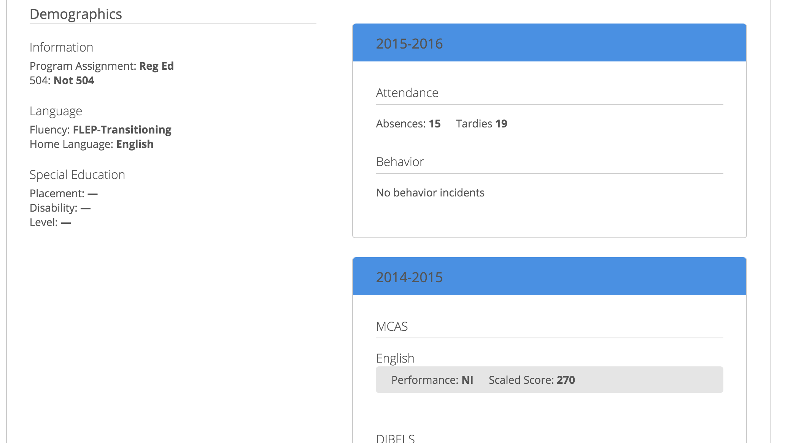
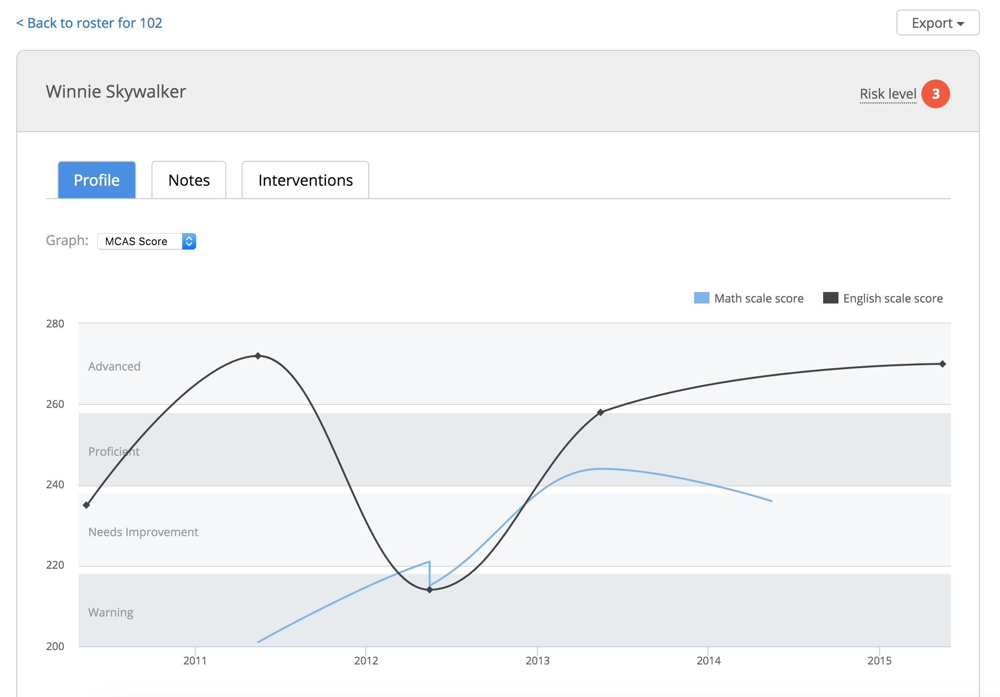
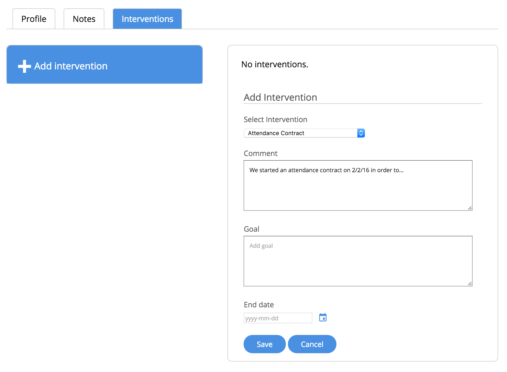

# Student Insights

[](https://travis-ci.org/studentinsights/studentinsights)
[](https://codeclimate.com/github/studentinsights/studentinsights/badges/gpa.svg)

Student Insights gives educators an overview of student progress at their school, classroom-level rosters and individual student profiles.  It also allows them to capture interventions and notes during weekly or bi-weekly student support meetings focused on the most at-risk students.  It’s currently in use at the pilot elementary school in Somerville.

Check out the [demo site](https://somerville-teacher-tool-demo.herokuapp.com/):
  - username: `demo@example.com`
  - password: `demo-password`

## Product overview
#### School overview
Principals and intervention specialists can get an overview of all students at school, updated automatically as new data comes in.  This includes demographic information (left), academic progress indicators (center), and educational interventions (right).


Educators answer specific questions like "how are 3rd grade students doing on reading assessments?" and "are students on free lunch programs equitably distributed between 5th grade classrooms?"  This is useful for understanding progress for groups of students, and also for identifying particular students in need of targeted interventions.


Data can be exported as a CSV for more sophisticated analysis.

#### Classroom rosters
Classroom teachers can see rosters of all students in their classroom, calling out high-need students and letting them jump into the student's case history and record of previous assessments and interventions.


#### Student profiles
Individual student profiles show how students are progressing on core academic skills, as measured summatively by MCAS or on more frequent formative measures like STAR assessments.



Student profiles also contain the full case history of demographic information, attendance and behavioral support.



We're working on some big improvements to the student profile page right now, check out [#5](https://github.com/studentinsights/studentinsights/issues/5) for more background.

#### Capturing meeting notes and interventions
It's one thing to have data, but acting on it to improve student outcomes is what really matters.  Schools with regular student support meetings for at-risk students can track interventions like additional tutoring hours, attendance contracts or social skills groups.  This is a building block to close the loop and monitor how effectively these interventions are serving students.



It also allows capturing meeting notes as part of the student's record, which is particularly important on interdisciplinary teams.

#### User experience
This is a web product, integrated with the Aspen SIS, district LDAP authorization and STAR assessments.  Principals and teachers sign in using their usual credentials, and can access the product securely anywhere they have internet access.  The project is primarily targeted browser is Internet Explorer, because that's what's used in the Somerville school district.


## Contributing
We'd love your help!  If you're interested in figuring out how to help, the best first step is to come drop into [chat](https://cfb-public.slack.com/messages/somerville-schools/), or connect with [Alex](https://twitter.com/alexsoble) or [Kevin](https://twitter.com/krob) on Twitter.

If you're an educator and want to try this out or have ideas about how to improve the product, we'd love to hear from you.  If you're an experienced developer or designer, there's some work we could use help with and you dive right into it.  We'll work with you to make sure your work can ship and will immediately help out principals and teachers.


## How it works
The project is a Rails app with a Postgres database.  There are background tasks that replicate data from the Aspen SIS system and STAR assessment system into the Postgres database.  This enables rapid iteration and experimentation on new product features with minimal risk to these existing production systems.  The Postgres database is the system of record for unique data captured by the Student Insights product (eg., notes from clinical meetings and information about targeted interventions that students are receiving).  Authentication is handled by the district's LDAP service.


## Development Environment

### Installation

This is a Ruby on Rails app and uses a PostgreSQL database.

Choose your favorite local development approach:

* [Local development with Docker](docs/local_development_with_docker.md)
* [Local installation on OSX or Linux](docs/local_installation_notes.md)

### Tests
This app uses [Rspec](https://www.relishapp.com/rspec/rspec-rails/v/3-2/docs). Run the test suite:

```
rspec
```

It uses [Jasmine](http://jasmine.github.io/) for JavaScript tests, run through the [Teaspoon](https://github.com/modeset/teaspoon) gem.  You can run them in the browser at `http://localhost:3000/teaspoon/default`.

You can also run them from the command line:

```
teaspoon
```

### Demo data

```
rake db:seed:demo
```

This will create demo students with fake student information. The demo educator username is `demo@example.com` and the demo password is `demo-password`.

Once you've created the data, start a local server by running `rails s` from the root of your project. When the local server is up and running, visit http://localhost:3000/ and log in with your demo login information. You should see the roster view for your data.


## Deployment
### Importing real data

If you're working with a real school district, you'll need flat files of the data you want to import.

Run an import task:

```
thor import:start
```

So far, Student Insights can import CSV and JSON and can fetch data from AWS and SFTP. To import a new flat file type, write a new data transformer: `app/importers/data_transformers`. To import from a new storage location, write a new client: `app/importers/clients`.

### LDAP

The project is configured to use LDAP as its authentication strategy in production. To use database authentication (in a production demo site, for example) set a `DEMO_SITE` environment variable. Authentication strategies are defined in `educator.rb`.

### Heroku

We deployed this app on Heroku and you can, too.

[Quotaguard Static](https://www.quotaguard.com/static-ip), a Heroku add-on, provides the static IP addresses needed to connect with Somerville's LDAP server behind a firewall. This requires additional configuration to prevent Quotaguard Static from interfering with the connection between application and database. One way to accomplish this is to set a `QUOTAGUARDSTATIC_MASK` environment variable that routes only outbound traffic to certain IP subnets using the static IPs. [Read Quotaguard Static's documentation for more information.](https://devcenter.heroku.com/articles/quotaguardstatic#socks-proxy-setup)

Set strong secret keys for `DEVISE_SECRET_KEY` and `SECRET_KEY_BASE` when you deploy.

### AWS

The project can also be deployed on AWS.  There's a starting point for provisioning and deploying scripts here:

```
/scripts/aws/
```

Scripts by the fantastic [Kevin Robinson](https://github.com/kevinrobinson).

### Your own server

Deploy on your own Ubuntu server (not AWS's or Heroku's):

https://github.com/codeforamerica/promptly-deploy-scripts/tree/somerville-v1


## More information
- For a history of all design iterations look here: https://www.dropbox.com/sh/r71hh9azun8v6as/AABtBghkPI4XUJBZjNpMmRdba?dl=0
- __[Team Somerville Mid-Year Report](http://codeforamerica.github.io/somerville-story/)__
- [Drop into chat](https://cfb-public.slack.com/messages/somerville-schools/), [sign up for Slack](http://public.codeforboston.org/)
- Connect with [Alex](https://twitter.com/alexsoble) or [Kevin](https://twitter.com/krob) on Twitter
