

# About us
Our team approaches these problems with one core value: we work to create more educational opportunity for young people, we don't just build software.  We believe that by building with communities, we all can be more creative, move more quickly, and be more empathetic than other models striving for scale.  We believe this "last mile" is where innovation really occurs, and it's precisely the place where most edtech business models can't reach.

What teachers and young people need are often very specific to their own community, school and classroom.  Different communities have different values, and different communities make different choices about what's important to them in education.  While many communities share common values, some emphasize preparation for achievement in college, others emphasize new ways of including all students in the classroom community, while still others emphasize more holistic forms of assessment.  These communities should be empowered to build around these core values, and make the school data systems that they need.

It'll take work, but what if our school data systems...

<ul class="PlainList">
  <li class="PlainList-item">...centered student strengths?</li>
  <li class="PlainList-item">...were built with educators, young people and families as equal partners?</li>
  <li class="PlainList-item">...proactively connected students with community and scholarship opportunities?</li>
  <li class="PlainList-item">...helped teams transiting to restorative justice approaches?</li>
  <li class="PlainList-item">...encouraged taking concrete actions in the face of "educational debt"?</li>
  <li class="PlainList-item">...helped educators as they make new assessment systems centered on learning instead of filtering?</li>
</ul>

### Who we are
Student Insights comes from the effort of many people over time, some working as educators and community leaders, some as designers and engineers, and many volunteering their time to help.

As Mica Pollock said before us, [it takes a network]({{site.links.takes_a_network}}).

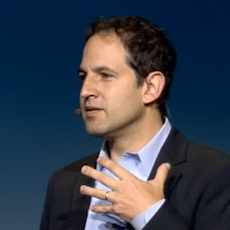

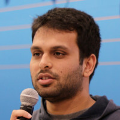

### How we work
While we work, we're committed to being open and transparent.  This involves a commitment to fully open-source software, and working collaboratively with school communities rather than selling anything to them.

Student Insight is open source software, which means anyone can see exactly how it works, or propose changes.  Local educators define any heuristics or algorithms themselves, so that they fully understand how the system works.  The project started in Somerville, and we're based there, but we've also built [partnerships with other school communities](school-partnerships.md).  We welcome working with community volunteers, and being a part of our local [Code for Boston brigade]({{site.link.code_for_boston}}) too.

  
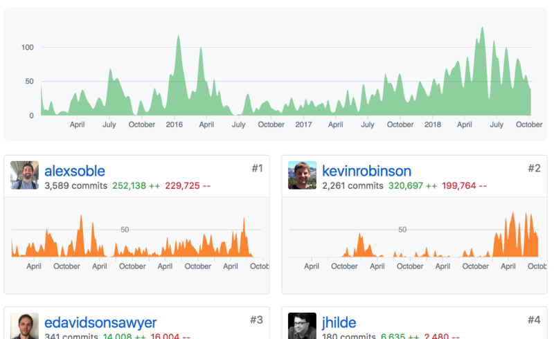

  

## Project history

<section class="ProjectHistory-section">
  
  
    
<a href="{{site.links.oneville}}">OneVille</a> is an separate project supported by the MacArthur foundation.  The project started in Somerville years before our work, but we see that team as our spiritual ancestor.  Their work on <a href="{{site.links.oneville_dashboards}}">data dashboards</a> and about <a href="{{site.links.schooltalk}}">how we talk about students</a> are particularly meaningful. (2009-2011)

    

  
  
    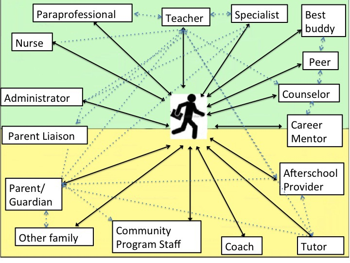
  
  
</section>

<section class="ProjectHistory-section">
  
  
    
A <a href="{{site.links.code_for_america}}">Code for America</a> fellowship created a small team that connected with educators in Somerville to create the first version of Student Insights.  We also connected with many awesome people in our local <a href="{{site.links.code_for_boston}}">Code for Boston brigade</a>, one of the largest and most awesome in the country. (2014-2016)

    

  
  
    

      

        
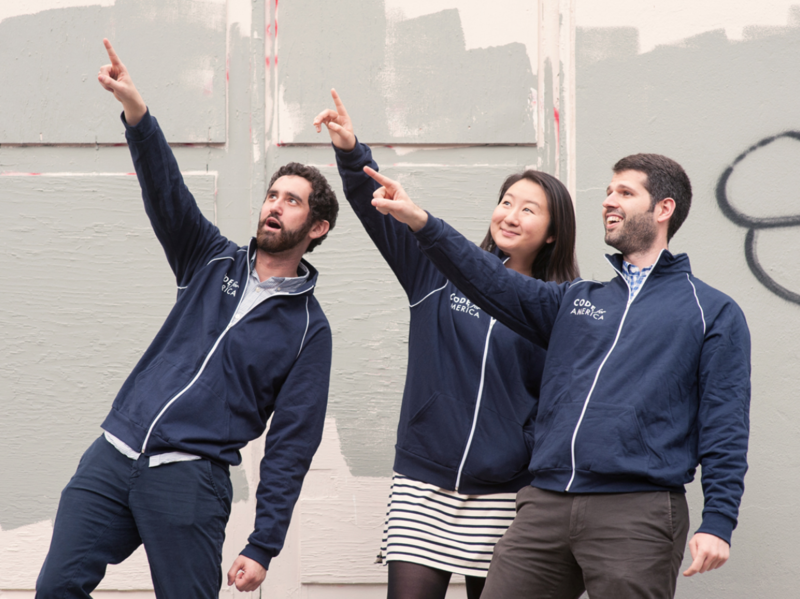

        
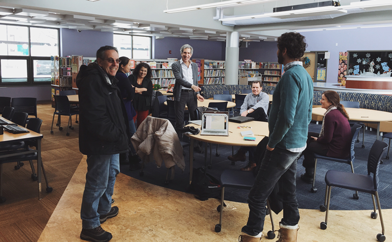

      

      

        
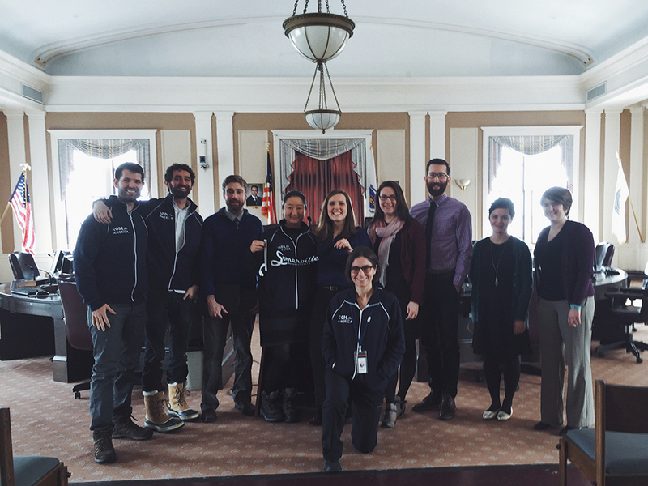

        
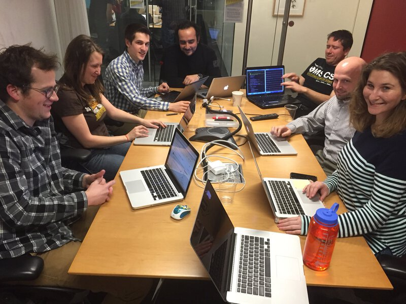

      

    

  
  
</section>

<section class="ProjectHistory-section">
  
  
    
We worked with <a href="{{site.links.microsoft_new_england}}">Microsoft New England</a> Civic Fellows on using data visualization tools as part of Somerville's data dives.  And we also started work on exploring how software tools might help K8 educators see potential equity issues while they're <a href="todo.html">creating class lists</a>. (2017)

    
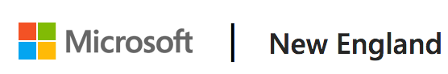

  
  
    

      

      
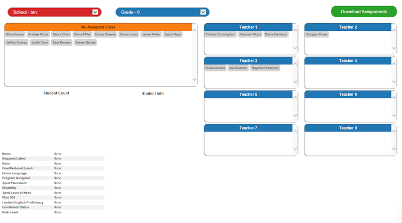

    

  
  
</section>

<section class="ProjectHistory-section">
  
  
    With a match from the <a href="{{site.links.boston_foundation}}">Boston Foundation</a>, Somerville continued work on Student Insights, growing to all schools in the district and starting work with high school educators. (2017-present)
    
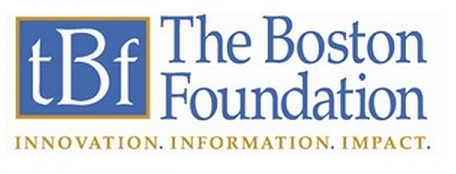

  
  
    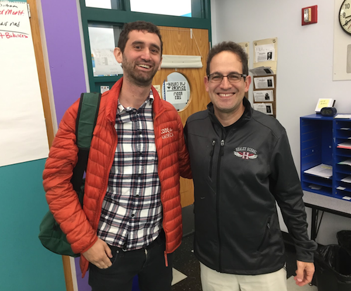
  
  
</section>

<section class="ProjectHistory-section">
  
  
    We've also used the match from the <a href="{{site.links.boston_foundation}}">Boston Foundation</a> to build partnerships with <a href="school-partnerships.html">New Bedford and Bedford</a> to collaborate and freely share the work we've done in Somerville.  We're excited to work alongside more schools and districts as we build this together, ourselves. (2017-present)
    

  
  
    
  
  
</section>

## Older writing, code and talks
In the spirit of building in the open, here are links to how we've thought about our work along the way, including old code, blog posts, talks, presentations and interviews.  This also reveals how the work has evolved - you'll see some things we worked on that we no longer work on, some areas of focus that we've invested in much more heavily in the time since, and hopefully we'll continue to grow as we build deeper relationships within school communities and find more ways to help create more opportunity for students.

- January 2015, [github.com/codeforamerica/somerville-teacher-tool](https://github.com/codeforamerica/somerville-teacher-tool/commit/599e6ac6d78dbecf25eed3ad4d916ff557c34fbd) is created!
- May 2015, [Code for Boston + Somerville fellows](https://docs.google.com/presentation/d/10SNXrZRwEIEC2CRn_mGS-V3KwtSuKUYkhGxYVa_moBE/edit#slide=id.g9acc1481b_0_0)
- June 2015, [**Code for America: Team Somerville's Story**](http://codeforamerica.github.io/somerville-story/)
- June 2015, [IGNITE Boston, NDoCH 2015](https://www.youtube.com/watch?v=CEZnDKtkhyI)
- October 2015, [**How Technology Encodes Values – Code for America Summit 2015**](https://www.youtube.com/watch?v=MzhKX49Pi0Q)
- February 2016, [github.com/studentinsights/studentinsights](https://github.com/studentinsights/studentinsights) is created
- May 2016, [Code for Boston Demo night: Student Insights](https://docs.google.com/presentation/d/1El6ByztkdkCuYnV7KLehV7zBvcfk-vUDL5vF_YxIcVE/edit#slide=id.p)
- June 2016, [What Is Hack Night Good For? A Somerville Schools Example](http://www.alexsoble.com/2016/06/06/what-hack-night-is-good-for-somerville.html)
- August 2017, [Microsoft: Using Data to Transform Somerville Public Schools](https://blogs.microsoft.com/newengland/2017/08/17/using-data-to-transform-somerville-public-schools/)
- November 2017, [**Somerville: Create, Innovate & Educate: with the Somerville Public Schools**](http://www.somerville.k12.ma.us/files/create-innovate-educate-somerville-public-school-nov-20-2017)
- August 2017, [Somerville Times: The Boston Foundation awards Somerville Public Schools a two-year $200K grant](http://www.thesomervilletimes.com/archives/78104)

<a href="our-work.html" class="btn">Our work</a>
