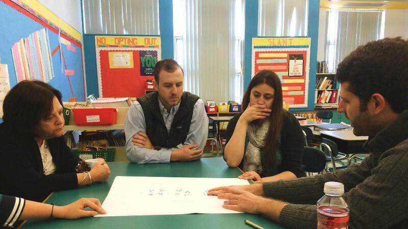
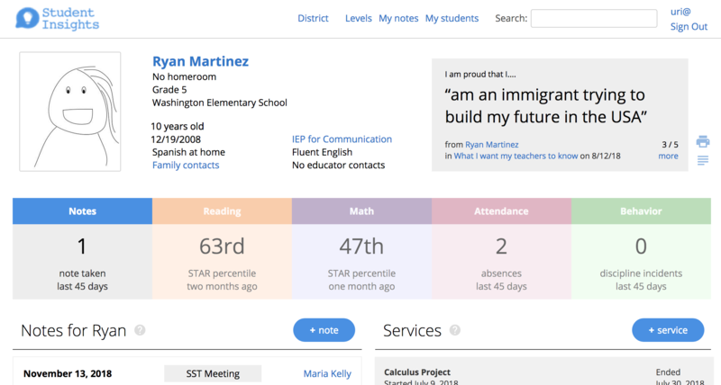
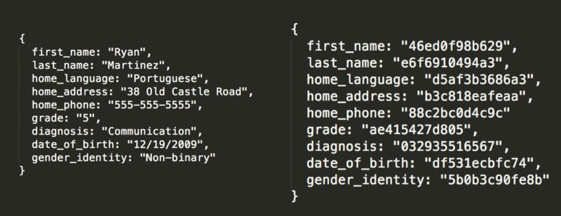



<section>
  
We work with communities to make student-centered data systems

  

    

        
    

    

      

        
It’s people closest to the work, <b>within school communities</b> - teachers, young people, families - who will be able to build the next generation of school data systems that they need.

        
We need more than just systems for counting numbers - we need ways to more deeply connect and tell our stories to tackle <b>what matters for our students.</b>

      

      

        <a href="about-us.html" class="btn Home-main-button">Learn more about us</a>
      

    

  

</section>

<h2 style="margin-top: 30px;">How we work</h2>
Student Insights started in one school in Somerville in 2014, trying to integrate data from different vendors' data systems.  We found right away that the technical side of data interoperability was the easy part - finding ways to **grow and sustain student-centered practices** was much harder, but more meaningful.

As we started working with more schools, we also shifted the way we worked.  We focused less on the technology and more on the **last mile** of how our work could influence practice.  This led to new kinds of opportunities, grounded in the core values of: *seeing the whole-child*, *student-centered narratives* and embracing challenges around *trust, access and privacy*.

<section>
  
  
  
    
"We want to understand young people as whole, not broken on the way in, and we want schooling and education to help keep young people whole as they continue to grow in a dynamic world."
- Django Paris

  
  
    
      

        A student profile example
      

  
  
    <a href="{{profile_href}}" class="btn">More about profiles</a>
  
  
</section>

<section>
  
  
  
    
"What we say shapes how adults think about and treat students, how students feel about themselves and their peers, and who gets which dollars, teachers, daily supports, and opportunities to learn."
- Mica Pollock

  
  
    
      

        A note created by a teacher about a student in a SST meeting.
      

  
  
    <a href="{{notes_href}}" class="btn">More about narratives</a>
  
  
</section>

<section>
  
  
  
    
"Will students be able to examine their educational record and demand that errors are fixed?  How long will data be kept on students? Will it move with them from school to school?  What sorts of data will be shared and with whom?"
- Audrey Watters

  
  
    

      
      

        Encrypting student information as one part of data security.
      

    

  
  
    <a href="{{privacy_href}}" class="btn">More about trust</a>
  
  
</section>

<section style="margin-top: 60px; margin-bottom: 30px;">
  <h2>Additional projects</h2>
  

    
    
    
  

  

    
    
    
  

</section>

<a href="updates.html" class="btn">What are we working on right now?</a>

