

# Our work
Our work on Student Insights built on the work that has [come before](about-us.html).  As we've worked, we found that three particular areas really resonated with the school community in Somerville.  Those have formed the core of Student Insights, that we've worked to deepen over time, and the base on which all other work has been built.

<h2 class="OurWork-SectionTitle">Whole-child profile</h2>
> "We want to understand young people as whole, not broken on the way in, and we want schooling and education to help keep young people whole as they continue to grow in a dynamic world." <a href="pals.html" style="display: block;">- Django Paris</a>

Student Insights started as an effort to pull together student data from different sources all onto one screen.  We've done this with a variety of data points - and we started with some standard things like IEP goals, English learner assessments, course enrollments and grades, attendance, discipline data, MCAS scores, STAR reading and math scores, and DIBELS subtests for reading.

<a href="img/our-work/profile.png" data-lightbox="profile">
  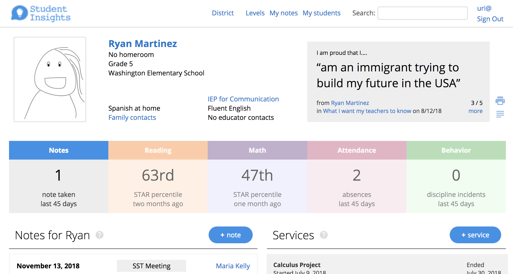 </a>

But along the way we started asking more questions with educators about how we should be representing students, and whether our work on this profile was really was reflecting the values of our school community.  We cam eto see that while pulling in multiple data sources can help students get what they need, it can also serve to define and limit young people.  Striking the right balance here is challenging but important, most especially at the transition point at the start of the school year.  When teachers get their classroom rosters, it's possible that the profile in Student Insights may be one of the first ways an educator is introduced to a student.

We also came to see that by building from the data points that were *easy for us*, our actions were drifting out of alignment with our values.  This is not a unique concern with educational technology - in a national survey described in the Parent Coalition for Student Privacy's [Educator Toolkit](https://www.studentprivacymatters.org/wp-content/uploads/2018/10/PCSP_BATS-Educator-Toolkit.pdf), one of the top concerns of educators surveyed was that *"They are worried that as the use of ed tech grows in the classroom, human interaction and individualism are being undermined."*  We aim to bring this tension to the forefront of our work, to explore opportunities to create a new way of tackling these problems by embedding more closely within school communities, and try to build a new kind of school data systems where the values of our school community come first.

We'll share a few of the steps that we've taken to this point, but we also see this as a fundamental tension in our work, and know there will always be work to strike the right balance.

### "Best light" principle
There can be a lot of benefit in sharing educational records between educators, and particularly at times of [transition](our-work.html#transitions).  This can help young people get the services and supports they need, and can help educators learn from what has worked well for that student in the past.

  <i>“When educators over-rely on secondhand information about students’ past academic or behavior records, this may lead to self-fulfilling prophecies. If teachers hear that students have excelled in the past or are predicted to do so in the future, research shows that even if that information is false, it tends to lead to more investment in those students, which enhances their chance of success. This is called the “Pygmalion effect.” Conversely, if teachers learn that their students have spotty histories, either in terms of their grades or behavior, they may suffer from the “Golem effect,” causing teachers to lower their expectations and disengage, which may in turn cause their students  to struggle even more.”</i>
  <a style="display: block; margin-top: 10px;" href="https://www.studentprivacymatters.org/wp-content/uploads/2018/10/PCSP_BATS-Educator-Toolkit.pdf">- Parent Coalition for Student Privacy</a>

At the same time, this creates risks that educators will be biased by the student's past, and that educational records may lead educators to make a set of assumptions about the student that shapes their relationship before even meeting the student.

One of our guiding principles on Student Insights is that we need to strike a balance that allows educators to share information about students, but that we aim to do so in a way that helps educators see young people in their "best light."  We've approached this in a few different ways in student profiles.

### "What I want my teachers to know about me"
<a href="img/our-work/survey-small.png" data-lightbox="survey-small">
  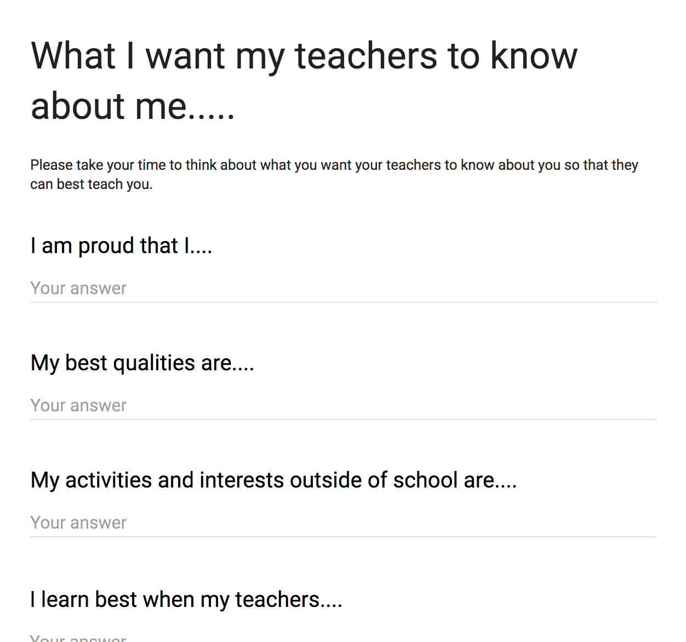 </a>

To elevate student voice, and give young people power over how they are represented within their Student Insights profile, we revised the layout of the page and reserved the most prominent space on the page for students themselves.

To start this, counselor educators worked with a group of middle school students to design a set of questions that the students would want to be visible on the student profile page to all the adults working with them.

At the high school level, educators in the English department got excited about this, and worked to have all students at the high school take this survey to start the school year.  Students share whatever they want in response to prompts about what they are proud of, what stresses them, and how they best learn.

We've heard from educators that seeing a student's perspective influences the way they experience Student Insights, and can help support educators in seeing students from a "whole child" perspective.

Here are some examples of the kinds of things students have chosen to share, and how this shows up front and center on their profile page:

  <a href="img/our-work/proud-computer-science.png" data-lightbox="proud-computer-science">
   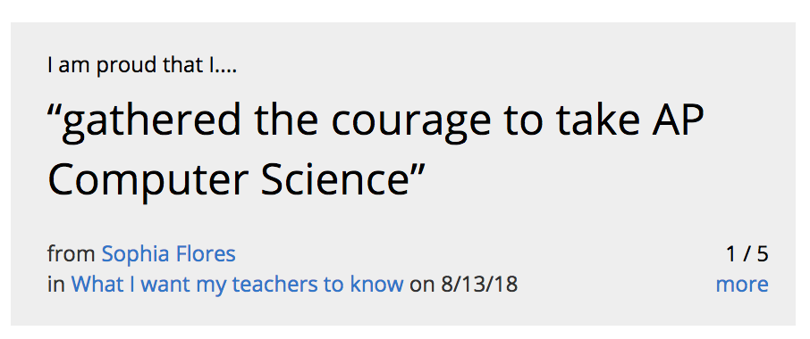</a>
  <a href="img/our-work/best-qualitities-babysitting.png" data-lightbox="best-qualitities-babysitting">
    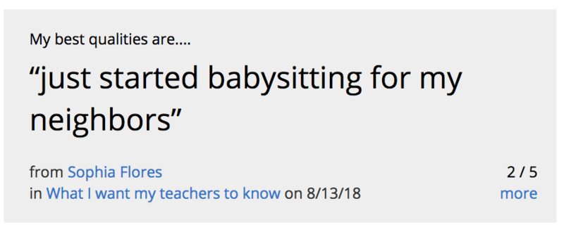</a>
  <a href="img/our-work/interests-podcasts.png" data-lightbox="interests-podcasts">
    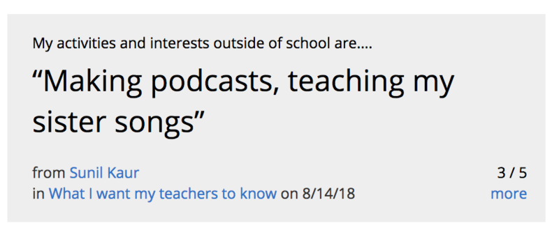</a>
  <a href="img/our-work/best-qualities-thoughtful.png" data-lightbox="best-qualities-thoughtful">
    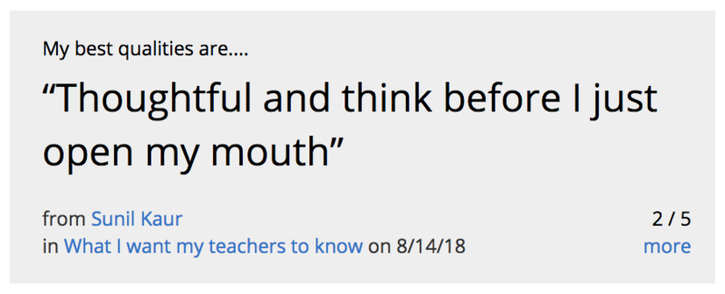</a>
  <a href="img/our-work/learn-best-kind.png" data-lightbox="learn-best-kind">
    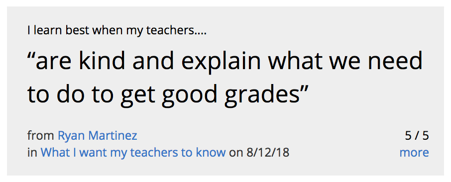</a>
  

### Student meetings
Within Somerville High School, there are a few student support structures aimed at helping students who are not thriving with the transition from middle school, and for supporting English learners in particular.  SOme educators had developed a practice of of using a school data system, exporting academic data into excel, and doing additional analysis, and then identifying students who were struggling across courses in a way that wouldn't be obvious to any one classroom teacher.  They then convened to discuss who had the best relationship with those students, and had 1:1 meetings to talk with the student about how they could support them.

These conversations embedded a strengths-based perspective and started with asking students about where they felt successful, and what supported them in those parts of their school experience.  We worked with these educators so that these conversations would be visible to all classroom teachers and educators working with the student in Student Insights.

  

    <a href="img/student-meeting-one.png" data-lightbox="student-meeting-one">
      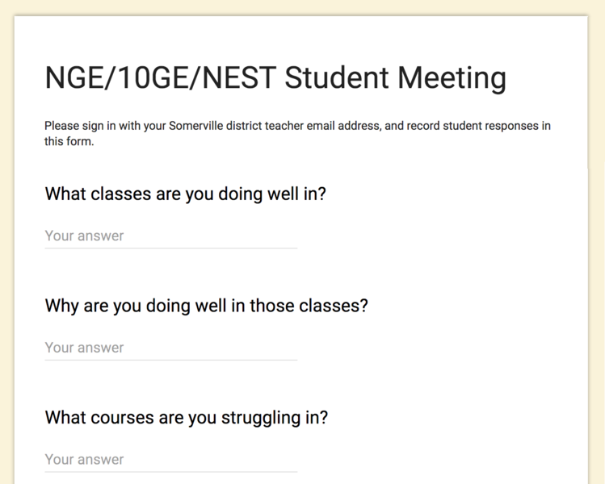
    </a>
    

  

    <a href="img/student-meeting-two.png" data-lightbox="student-meeting-two">
      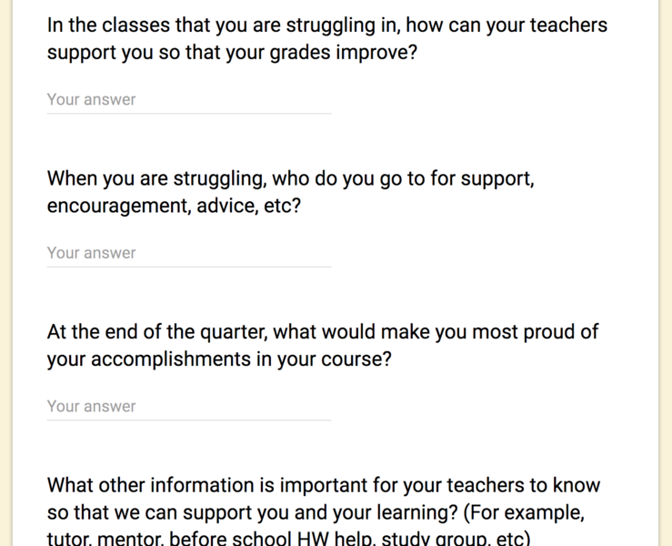
    </a>
    

### More holistic "whole child" perspectives
Beyond creating space for student voice, we've also worked with educators around what other kinds of data there is about students that could more fully describe their experience at school.  One theme that came up consistently for many students in student voice surveys when we asked what they wanted teachers to know was how important sports were.  In talking with the athletic director at the high school, we collaborated to add sports team membership into the student profile, and to add the contact for coaches.  Experienced teachers, and teachers with strong relationships often already know this about their students.  But this let us update our school data system to reflect this important aspect of students' school life, and make it immediately visible to all educators, and displayed more prominently than things like their scores on state testing.

  
<a href="img/our-work/cheerleading.png" data-lightbox="cheerleading">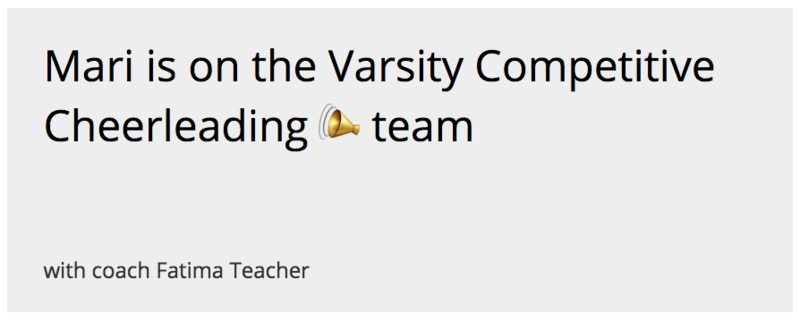</a>

  
<a href="img/our-work/soccer.png" data-lightbox="soccer">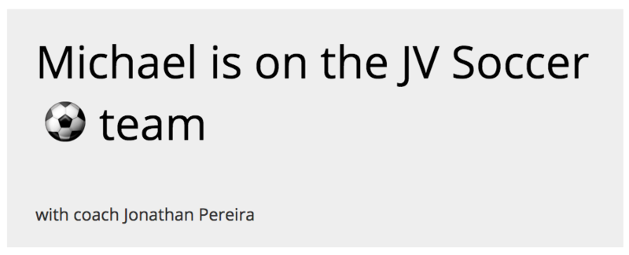</a>

We also worked with folks in the central office who coordinate summer services, so that when educators came back in the fall, they could see what services the student experienced during the summertime.  This let us collaborate closely with one educator, rather than trying to roll out the burden of a new data entry procedure with educators across the district.  We've also explored automated syncs to create hybrid data systems where educators can fully control the data in tools like online spreadsheets that they are already comfortable with, and we can do the work to sync changes to Student Insights in real time.

  <a href="img/our-work/services.png" data-lightbox="services">
    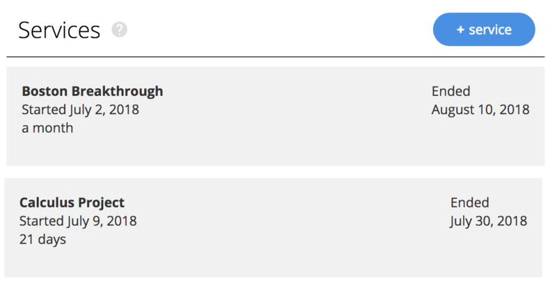</a>

### "Clean slate"
The "clean slate" concept came from a team of educators discussing concerns about how past data systems have labeled students in ways that student with them and never changed.  Some examples were students who traveled to visit family at the beginning of the school year, and were marked as "at risk" for absence the rest of the school year.  Another was students who would be marked "at risk" because of a standardized test score from a year and a half ago, even if other data points suggested they were thriving at school.

  

    

      <i>"Often I’ll go into a workshop with teachers and write on the board, or whatever they have there for me to scribble on: “high blood pressure,” “high cholesterol,” “stroke,” “asthma,” “cancer,” and I will say, “I’m at risk for all of these things. But nobody calls me ‘at risk.’"</i>
      <a style="display: block; margin-top: 10px;" href="docs/glb.pdf" target="_blank" rel="noopener noreferrer">- Gloria Ladson-Billings</a>
    

  

  
<a href="img/privacy-note.png" data-lightbox="privacy-note">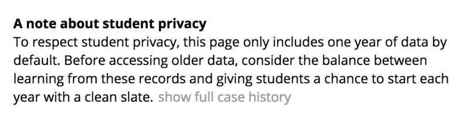</a>

To strike the right balance here, within Student Insights most numeric data in a student's profile is focused on the last 45 days of school or the current school year, and all these data points have context about when the data point was from.  Educators can click into tabs and see more historical information, but there is also a prompt about this core tension in how educators use school data systems.  This is a central theme in all of the Student Insights [trainings that educators lead](trainings-and-videos.html) as well.

<h2 class="OurWork-SectionTitle">Student-centered narratives</h2>
> "What we say shapes how adults think about and treat students, how students feel about themselves and their peers, and who gets which dollars, teachers, daily supports, and opportunities to learn."<a style="display: block;" href="pals.html">- Mica Pollock</a>f
When we originally built Student Insights, we had no idea how popular and powerful it would be to add the simple ability for educators to say something about what was going on with a student.

Writing notes lets educators share information and insights with other so everyone can know what’s going on with a student.   This includes what other teachers have tried, what’s worked, and what hasn’t worked.   This is particularly important for student support team structures where there's a interdisciplinary team that evolves over time.  Districts have a variety of names for these such as SST, BBST, MTSS, Wellness, and NGE.

  
<a href="img/our-work/take-notes-long.png" data-lightbox="take-notes-long">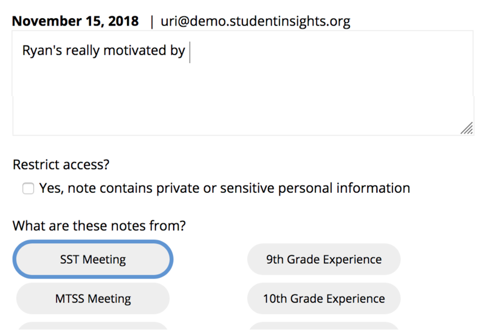</a>

  
<a href="img/our-work/notes-guidelines.png" data-lightbox="notes-guidelines">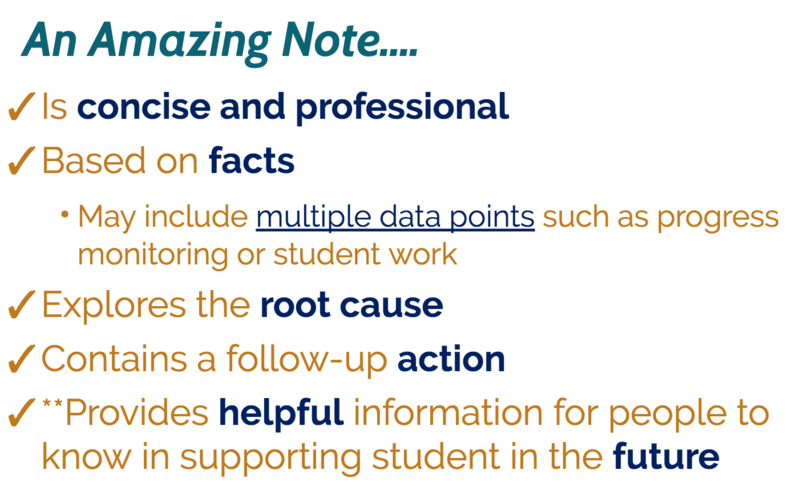</a>

[Educators leading trainings](trainings-and-videos.html) have chosen to focus on how to write effective notes, but also highlight how to *read* the notes that others are written, so that adults can get the most helpful information, give students the clean slate they need from year to year, and see the student in the best light.  One of the questions educators ask in trainings is: "What would you have wanted your own 6th grade teacher to know about you to best teach and support you?"  or "I wonder what’s really going on for the student, what motivates them, and where their areas for growth are?"  We've found this framing grounds the conversation in the human side of our work and makes space for talking about the assumptions and bias that can arise when reading student educational records.  From here, we work with educators to think more deeply how to effectively read and write notes about students, so that student data is used in a positive way to help maximize student growth and achievement.

  
<a href="img/our-work/feed.png" data-lightbox="feed">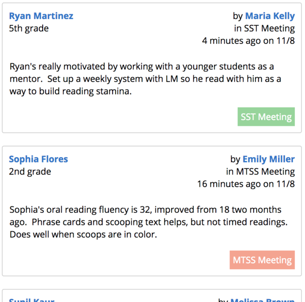</a>

  

Notes about a student are also visible to other educators who are authorized to access that student's data (see [trust, access and privacy](our-work.html#trust-access-and-privacy) for more about how we approach these important issues).  This is especially for interdisciplinary teams, and teams of educators that work with students across diverse roles (eg, science teacher, writing teacher, social-emotional support, college and career counselor, etc).  When signing into Student Insights, the home page shows teachers what's going on for all their students.  This isn't a replacement for talking in person, or for email, or for structured reporting like Progress Reports or amendments to an IEP.  It's also not a chat app sending notices during class.  It's a space for educators to share what's important as they do their work with students each day, and to check in whenever they want to see what's going on with students more holistically.

<a href="img/our-work/home-feed-short.png" data-lightbox="home-feed-short">
  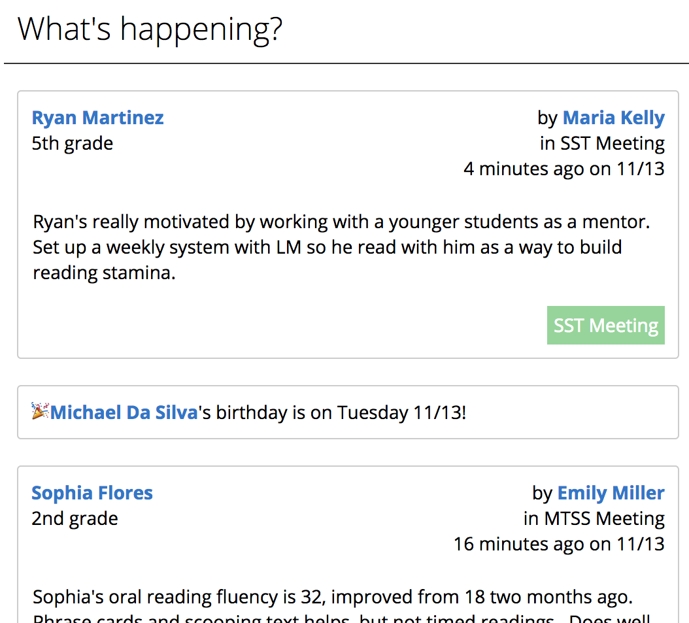
</a>

When working with educators teams deciding how they want to use Student Insights, one experience we share is how this has been most effective in Somerville for structure support teams or PLCs teams that are already up and running.  Within support structures like MTSS or SST, there is often an interdisciplinary team, and taking notes about what's going on with the student holistically and what actions the team is taking can be a helpful starting point.  Educators have also found [transitions](our-work.html#transitions) between classes or grades can be a helpful place to start, and that's a project we've worked on separately as well.

Educators have also developed thoughtful protocols around specific kinds of conversations, or how to take notes about them.  This has come up with ["What I want my teacher to know about me"](#what-i-want-my-teachers-to-know-about-me), [student meetings](#student-meetings) and also with [transitions](#transitions).  In those cases, we've built integrations to other data sources like forms and spreadsheets, so that educators can fully own and shape these however they think is best, while we do the work on Student Insights to sync those notes and conversations with students.

Finally, educators also asked to be able to further restrict access to notes beyond the normal access roles.  Administrators and counselors can mark a note as "restricted" to respect a student's privacy and limit access even further.  When working with older students, counselors also use these moments to tangibly demonstrate their respect of student privacy - asking to share certain topic with other educators, sharing some topics that are "restricted" a more limited way, and keeping some topics entirely confidential and never entered into any school data system but only in their own counseling notebook.

<h2 class="OurWork-SectionTitle">Trust, access, and privacy</h2>
> "Will students be able to examine their educational record and demand that errors are fixed?  How long will data be kept on students? Will it move with them from school to school?  What sorts of data will be shared and with whom?" <a style="display: block;" href="pals.html">- Audrey Watters</a>

Building trust is one of our core values, and also one of the toughest challenges for any real-world data system.

### Trust
For Student Insights, all conversations about school data systems comes back to whether our work is improving opportunity for students or improving working conditions for teachers.  Part of our work is exploring with educators what opportunities there are for school data systems that make sense from *within* their school communities.  Trust - between students, families, educators and software developers - is the key ingredient.

One part of building that trust is taking responsibility for ways in which our work might contribute "the risk that faulty data will be used to make decisions," cited as one of the largest concerns about data privacy in a national survey by the [Parent Coalition for Student Privacy](https://www.studentprivacymatters.org/wp-content/uploads/2018/10/PCSP_BATS-Educator-Toolkit.pdf).  When working with new data sources, that typically means sitting and talking with educators about data quality explicitly before we release any new software features using that data.  This can prompt conversations about data quality issues upstream (eg, at the point of entry), or school policies or practices that influence data quality (eg, concerns about accountability consequences).  For us, working through the complexity here is central to school communities being able to effectively use school data systems.

Creating atmosphere of collaboration.  Our goals are usually around surfacing information that can start conversations about growth, rather than for purposes of teacher evaluation or school accountability.  Usage of the system is opt-in, rather than mandated as part of a roll-out process.

### Access
School communities are complex, made up of diverse groups of young people, teachers, counselors, families, after-school coordinators, administrators, and people playing many other roles.  This means that controlling who has access to what data is complex as well.  While we started with an intention to keep access controls as simple as possible, we quickly found that school communities needed more powerful and fine-grained control.

For school communities, Student Insights has several layers of permissions.   The first layers are determined by existing data district systems (eg, who has access to sign in, what role do they have) and we've created additional layers with a more specific access system that allows schools to decide which students each educator should have access to.  More details are available [here](https://docs.google.com/document/d/1THekg_5gFdm5dIHANJgcoxEajlH4UjL4U0-nYJjI2WY/edit?pli=1).  Beyond per-student access.

We're still working to figure out the best way to build trust and invite young people and families into this space.  Some first steps there have been educators who have begun using Student Insights within student converences and parent conversations, and with inviting young people to collaborate together on how we might do this.  The technology itself is the simplest part here, but working to build trust within the school community so that the data system becomes a space where educators, young people and families join in as equal partners is what we aspire to.

On the Student Insights development team, access to student data is limited and tightly controlled and most contributors have no access.  This design allows us to collaborate safely with [many open source contributors](about-us.html#who-we-are) without granting access to any student data.  Some contributors sign data sharing agreements with particular districts if they are collaborating on specific projects (eg, exploring the effectiveness of different school interventions), and in those cases we limit access to one-time, anonymized data sets.  Only a few core contributors have access to production data, and then only when they are involved in maintaining the infrastructure and security of the system.

### Privacy
While many companies talk about student privacy, one of our core values from the beginning of this project is to truly embody this in our everyday work.  While many educational technologies sell or share student information with other parties for either research, targeted advertising, or marketing purposes, Student Insights does not and never will.

  
On the Student Insights team, we:

  <ul class="OurWork-PrivacyList">
    <li>do not use any data collected to target ads</li>
    <li>do not create advertising profiles on students or educators</li>
    <li>do not sell student or educator information</li>
    <li>do not disclose information, unless required by law</li>
    <li>do use sound information-security practices, including encrypting data</li>
    <li>do review security practices every quarter</li>
    <li>do delete data whenever the school or district requests it</li>
  </ul>

FERPA, the [Family Education Rights and Privacy Act](https://www2.ed.gov/policy/gen/guid/fpco/ferpa/index.html), is a federal law which aims to protect the privacy of student records - Who can access records?  Under what conditions?  What rights to parents and students have with regards to the contents?  The technology landscape has changed a lot in the 44 years since FERPA was passed.  We see FERPA as the "floor" when it comes to privacy and are striving, even though it is hard and complex, to go beyond this standard.  We see work from organizations like the [Parent Coalition for Student Privacy](https://www.studentprivacymatters.org/wp-content/uploads/2018/10/PCSP_BATS-Educator-Toolkit.pdf), [Common Sense Privacy Evaluation Initiative](https://www.commonsense.org/education/sites/default/files/tlr-blog/cs-state-of-edtech-privacy-report.pdf) and the [Future of Privacy Forum](https://fpf.org/issues/k-12-education/) as providing guidance that we aspire towards making real in our work.

Within the language of FERPA, Student Insights provides an institutional service or function for which the school or district would otherwise use its own employees.  In FERPA, this is known as the "school official exception," and districts can do this without requiring explicit parent consent.  Because of this exception, Student Insights is *under the direct control of the school or district* with regard to the use and maintenance of education records.  Student Insights does not disclose any public "directory information."  Under FERPA Student Insights can use education records only for authorized purposes and cannot re-disclose any personally identifiable information from education records to other parties.  Like all educational records, Students and parents can request access to the data stored in Student Insights at any time through the school or district.

One of the aims of our work is to explore new ways to build school data systems, by embedding within school communities and collaborating more deeply.  This is a concern we hear coming from the school communities we work with, and echo what others have found as well.  For example, these were the top concerns about technology and privacy in a recent survey of educators from the [Educator Toolkit for Teacher and Student Privacy](https://www.studentprivacymatters.org/wp-content/uploads/2018/10/PCSP_BATS-Educator-Toolkit.pdf):

- *"Too much personal data is being collected and shared with vendors, with the risk that it may be monetized."*
- *"Educators are being forced to implement ed tech products, which use data in ways they do not understand."*
- *"There is a critical need for more training on how to protect their own personal privacy and that of their students."*
- *"Teachers being forced to use a particular vendor, like Google"*

We look forward to partnering with others working on these problems, and hope to share our work as one way to make progress on the fundamental challenges of building data systems that serve school communities.  We see other work like [Transparency and the Marketplace for Student Data](https://www.fordham.edu/info/23830/research/10517/transparency_and_the_marketplace_for_student_data/1) as a warning about a future where we do not take actions address these challenges ourselves.

Like most organizations, we do rely on third-party services to operate Student Insights.  These dependencies are reviewed as part of our quarterly internal security audit, and there are more technical details on GitHub.  If you know of ways we can reduce these dependencies, or want to help build open-source alternatives, we'd love to talk!

<h2 class="OurWork-SectionTitle">Additional projects</h2>

### Transitions
While educators have continually surprised us with how powerful they've found the simple ability to share notes about students with their colleagues, we've also heard that there are particular communication gaps around transitions where Student Insights could really help.

These transitions come up at various times: when a student moves from one school to another, when they successfully return to a district school from a special education placement, or in response to other changes that come up throughout the year.  But there are also some transitions that are predictable, and at the end of the 2017 school year, counselor educators in Somerville asked to talk about how we could support the transition from 8th grade to 9th grade.

Previously, 8th grade counselors would write out a "transition packet" for all students.  To make sure important information traveled up to the high school, in the past this had also included writing out things from the student's educational record that had since been made more visible in Student Insights.  So we worked with counselor educators and the district student support services team to streamline the process to a few key questions.  This cut down the time counselor educators had to spend on doing paper data integration, and focus their in-person discussion time with the 9th grade counseling team on the most important aspects of their counseling relationships.

  

      <a href="img/our-work/transition-left.png" data-lightbox="transition-left">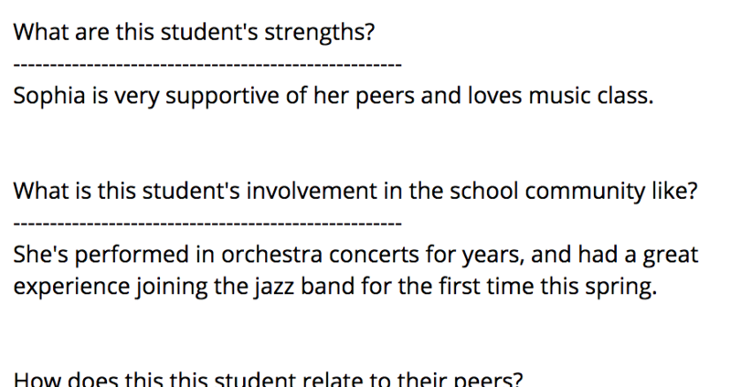</a>
    

  
<
      <a href="img/our-work/transition-right.png" data-lightbox="transition-right">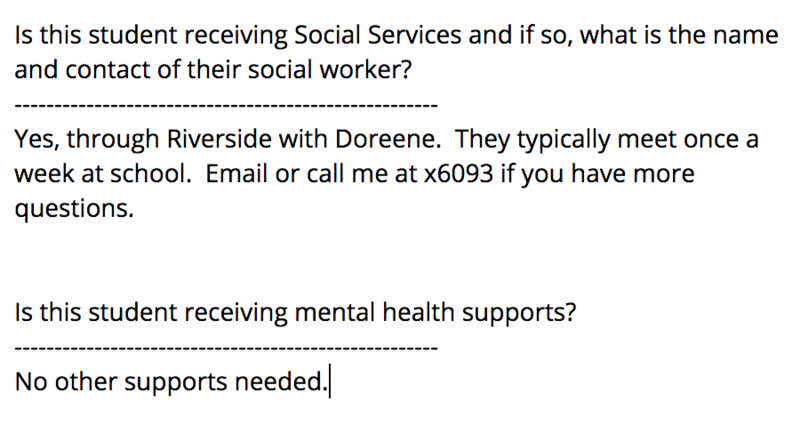</a>
    

We also worked with counselors so that some transition information would be widely visible to all educators working with students, so that these could help to introduce students by way of their strengths and interests.  For other important confidential information, counselors designed a separate box that would clearly indicate the information was confidential, and access for this part of the transition packet would be restricted.

### Attendance supports
School attendance is a challenge for many students and families for a variety of reasons, and educators have different ways to support students after they've missed a period of school, or to problem solve around morning transitions and routines.  Within Somerville, interdisciplinary student support teams (SST) meet regularly to talk about what's going on with students and how to best support them.

As part of this work, one idea we explored together was whether a "dashboard" showing school attendance over time would help, or whether there were ways to create visualizations for finding different patterns in attendance data (eg, by grade level).  We worked with principals and assistant principals looking at this, and using data analyst tools like Tableau and PowerBI.  Over time we found this narrow anlaytic approach wasn't a natural fit for the kinds of complexity that these teams were already considering and discussing.  We found that these visualizations might feel fun to explore, and they seem interesting to people who weren't in the school day-to-day.  But for most educators building close relationships with students and families, these visualizations rarely led to true insights.

Another challenge that came up was in conversations where we looked at full year counts of absences.  Educators had developed a sense of when this indicated a significant issue, but existing data systems were aimed at counting whole-year totals since they were first developed for other purposes like accountability reporting.  We found that later in the school year, students who had great attendance all year but only just recently started missing school would slip through.  When looking at the count for the whole year, those students might miss more than a week of school and not be immediately visible to educators.

  
<a href="img/our-work/absences-analysis.png" data-lightbox="absences-analysis">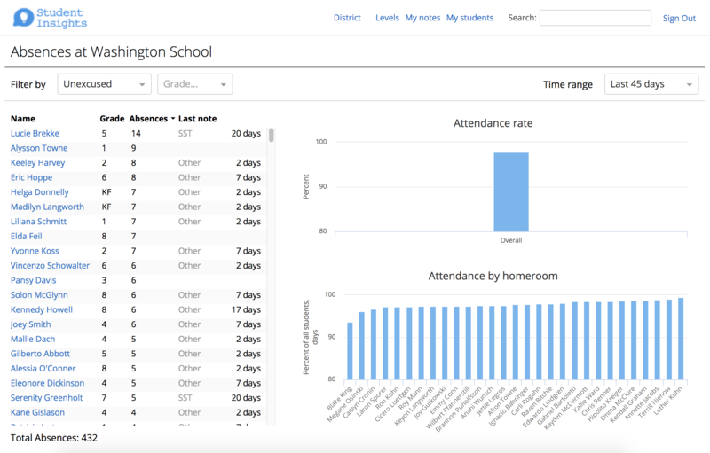</a>

  
<a href="img/our-work/absences-home.png"
  data-lightbox="absences-home">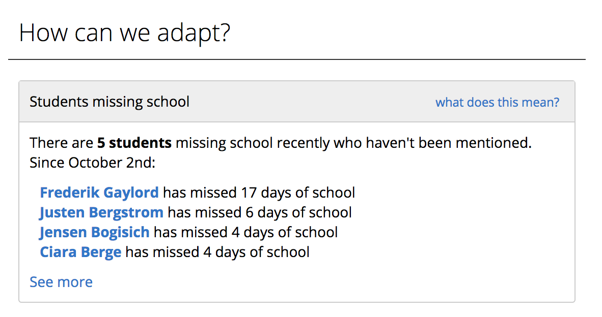</a>

This led us to shift from a goal of "analysis" and "finding patterns" to a goal of supporting educators to see what's happening with students recently and to take action to support those students.  This involved building a notice for all educators on the home page about recent absences for their students.  And for building a more focused visualization looking at absence data, and highlighting gaps where students have missed school recently but haven't yet been discussed in SST or other support meetings.  In this way, educators can open the page and immediately see students who could use support.

### Class lists
This project started from the needs of a few teachers to make the class list process easier and became even more meaningful as we started talking with folks about equity in the process.  In many schools, teams of teachers gathered in the spring to create class lists for their students as they move to the next grade.  Typically, each student's name would be written on a card, possibly with some extra information on it such as gender, special education or English learner designation, academic proficiency, and behavior.  The cards were then moved around until the teams determined that each list had the makings of a strong classroom community.  Many educators felt that not only was this incredibly time-consuming and inefficient, but also prone to errors, biases, and favoritism.

  <a href="img/our-work/class-list5.png" data-lightbox="class-list5">
  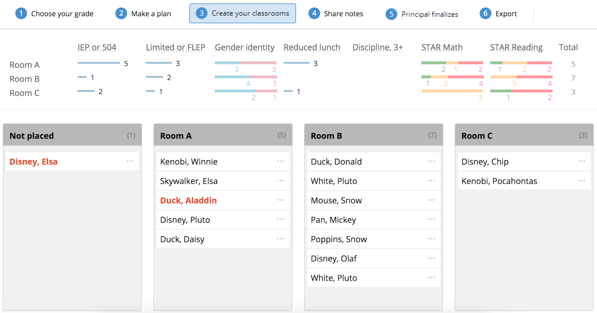
  </a>

So we worked with several teams of teachers to mock-up, design, and test a new way to do it.  By dragging and dropping names into different possible classes, teachers could see how the composition changed on a variety of measures.  In the process, we worked with teams across K8 schools to put together guidelines for how this process works at it's best.  The first recommendation was for teams to start the process by asking: *What's our plan for creating classroom communitites?*  and writing their thinking out.  We found that some teams start with considering social dynamics, splitting up students who are leaders or who don't work well together.  Others start creating groups with diverse academic strengths.

<a href="img/our-work/class-list6.png" data-lightbox="class-list6">
  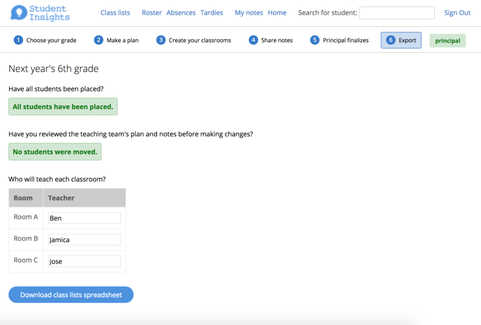
</a>

We then did a training with all Somerville teachers grades 1-5 who were interested, and almost all classroom teams used Student Insights to make their classroom lists.  To finish, they submitted their final class lists to the building principal along with any other notes about their rationale.  Over the summer, as enrollment changed or other issues came up, principals could look back at the intent of the teaching teams and consider that when making any changes.  Finally, these changes would be visible to the classroom teaching teams as well to close the feedback loop.  In collecting feedback afterward, educators found that the new process encouraged better conversations during the process, saved time, and helped them create more equitable communities.

This also created an interesting research question that we're working on ahead of next school year - what does an strong classroom community look like, and what does equity within the class assignment process mean?  These are tough questions for any school community, and we're excited to continue working on this in ours, and with researcher colleagues on ways to frame and explore this question together.  We're also excited about the opportunity to incorporate parent or student input earlier in this process as well - many schools gathered input from students and families before beginning the process, but that was done outside of Student Insights.  We'd love to explore improving the end-to-end experience for students and families as well.

### Grades and academic supports
At Somerville High school, one of the support structures focused particularly on helping ninth grade students make the transition from middle school to high school.  This support functions both as an interdisciplinary team PLC for teachers, and a space where they can collaborate on how to support students outside of traditional disciplinary boundaries, and grow together around specific instructional strategies or changes in practice.

We initially collaborated with this team to create a [new home page](#student-centered-narratives) showing what's going on with all students that an educator works with.  But one challenge that came up is that they wanted the data system to support them in seeing all the students across their courses that were struggling with their grades.  This was something they could look at a few times during the school year at the end of each quarter - after students received final grades - and they wanted to be able to respond more quickly as students grades changed from week to week.

  

    <a href="img/our-work/communication-and-actions.png" data-lightbox="communication-and-actions">
      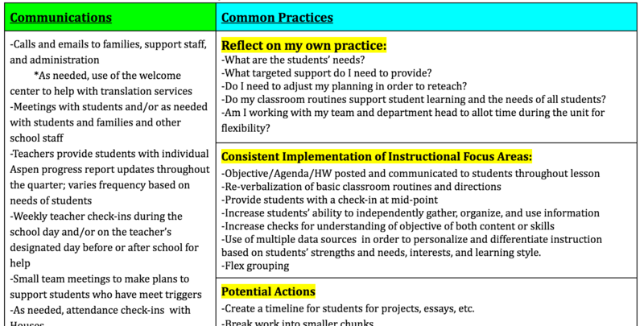
    </a>
  

  

    <a href="img/grades.png" data-lightbox="grades">
      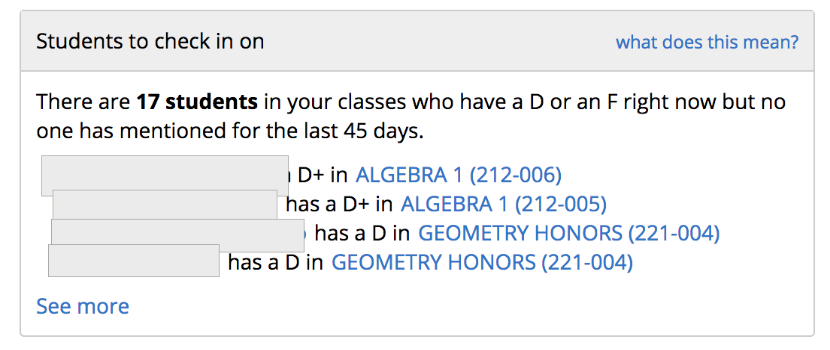</a>
  

To make this as simple as possible, and to fit this within the existing meeting flow for this support structure, we added this right onto the home page for high school teachers as soon as they sign in to Student Insights.  There's no querying, no filtering or anything else - if there are students in their courses who need more academic support or if a particular unit or assessment ends up influencing grades for many students, educators can see that right away and get to work on collaboraing to try other instructional strategies.

### Triggers for Systems of Supports
One opportunity that came up working with educators at Somerville High School was around how the team adapts the supports it provides to students.  In the HS, there's a diverse range of services for students focused on all kinds of things like study skills, academic supports, social emotional supports, wraparound services, health services, the transition to high school from middle school, English learning services and many others.  To help with matching students to the services they need, the team had put together a document describing the systems of supports and services, and different "triggers" that students might reach as a way to facilitate adapting services.  But there was no data system that could show what supports a student was getting across all educators, or to find when a student should be getting a support but the team hadn't responded yet.

  

     <a href="img/our-work/triggers2.png" data-lightbox="triggers2">
        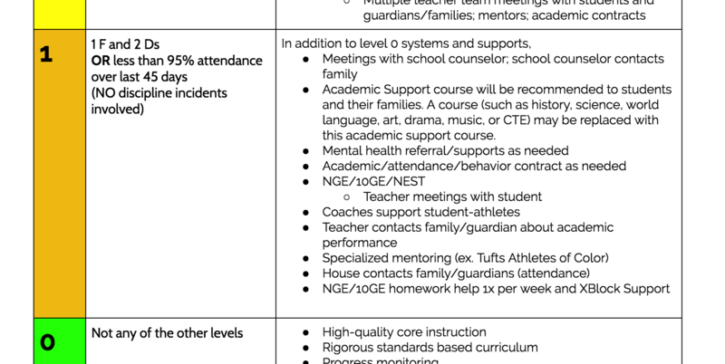</a>

  

    <a href="img/our-work/levels4.png" data-lightbox="levels4">
      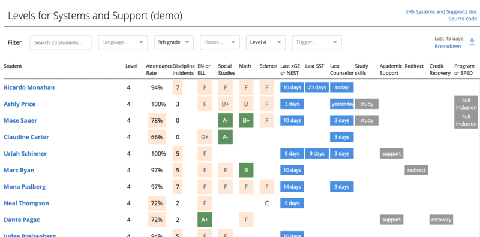</a>

We collaborated with a team of teachers, department heads and admins to create a way for everyone in the school could see the same picture of these triggers and what students need, and to make this visible every day instead of just at the end of every quarter.  This way educators could just sign in, see what students needed more supports, and get to work figuring out how to do that together.

Importantly, the process of thinking through and creating these triggers and levels was entirely driven by educators and not by a data scientist or a machine learning researcher.  This means that the educator team is in control of the data system, and understands exactly what it's doing.  Within Student Insights there's a link directly to the educator documents describing the triggers and levels, and right next to it there's a link to see the open source code.

  

    <a href="img/our-work/levels-filter.png" data-lightbox="levels-filter">
      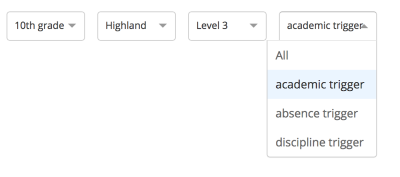</a>

  

    <a href="img/code.png" data-lightbox="code">
      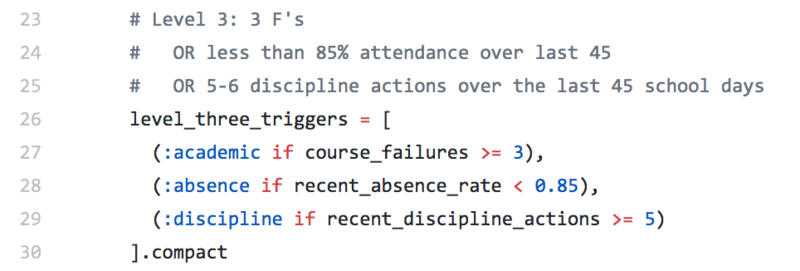</a>

This work also led to conversations across the HS admin team about some of the challenges in flexibly adapting in response to what students need, and different supports and services that aren't yet visible in these data systems.  We're excited to keep working on this and help with making the full "menu" of services and supports in the school system visible to everyone, and be a part of helping students get what they need when they need it.

<a href="updates.html" class="btn">What's next?</a>

