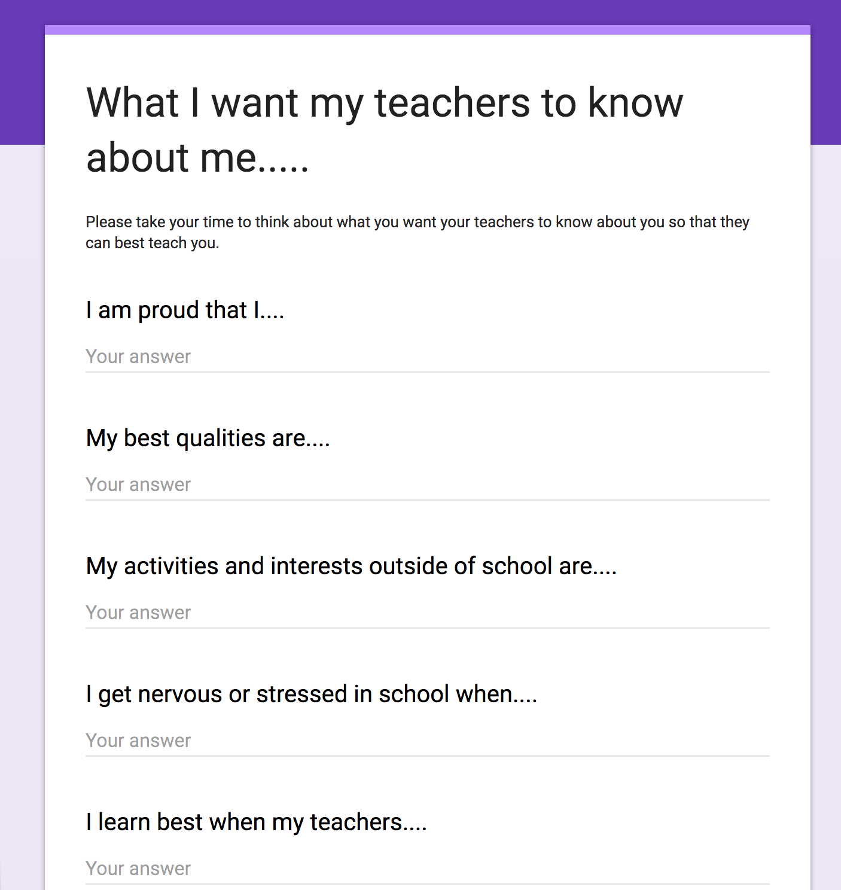
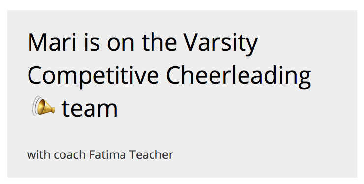
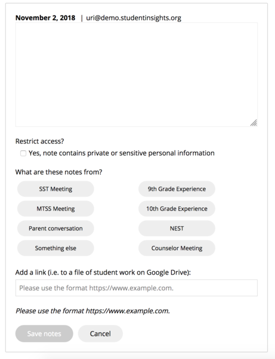
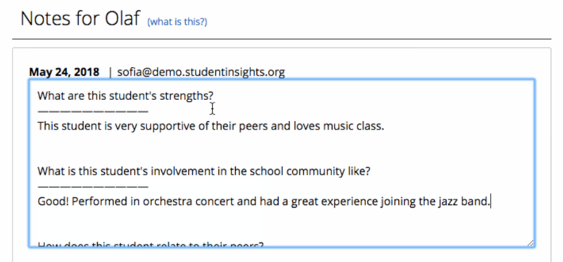
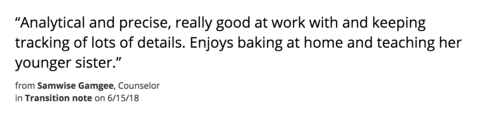



# Our work
Our work on Student Insights built on the work that has [come before](about-us.html).  As we've worked, we found that three particular areas really resonated with the school community in Somerville.  Those have formed the core of Student Insights, that we've worked to deepen over time, and the base on which all other work is built.

## Student-centered profile
Each student has multiple staff members working with them who knows different pieces of information.  Each student has a range of data points such as demographic information, standardized test scores, grades, and attendance records, .  Students participate in various programs and have different interventions.  Each student has their strengths, weaknesses, interests, and things that motivate them.  Students Insights helps you see all of this, so you can best support your students.

Last Spring, as usage greatly increased across schools, rather than build more features, we decided to focus our design and development efforts for a few months to address this problem: *With all the information being generated and compiled in Student Insights, how do we ensure that students are seen in the best possible light?*

This is best stated by the Parent Coalition for Student Privacy's [Educator Toolkit](https://www.studentprivacymatters.org/wp-content/uploads/2018/10/PCSP_BATS-Educator-Toolkit.pdf).  One of the top concerns of educators surveyed was that "They are worried that as the use of ed tech grows in the classroom, human interaction and individualism are being undermined."  This is a real concern that is in the forefront of our work, and the opportuntity to create a new way of tackling these problems is one of the things that drive us.  So far we have taken these steps, but also see this as a fundamental tension in the work, and know there is a lot of work still to be done.

#### "Best light" principle
There can be a lot of benefit in sharing educational records between educators, and particularly at times of [transition](our-work.html#transitions).  This can help young people get the services and supports they need, and can help educators learn from what has worked well for that student in the past.

At the same time, this creates risks that educators will be biased by the student's past, and that educational records may lead educators to make a set of assumptions about the student that shapes their relationship before even meeting the student.  As the [Educator Toolkit](https://www.studentprivacymatters.org/wp-content/uploads/2018/10/PCSP_BATS-Educator-Toolkit.pdf) says:

  > “When educators over-rely on secondhand information about students’ past academic or behavior records, this may lead to self-fulfilling prophecies. If teachers hear that students have excelled in the past or are predicted to do so in the future, research shows that even if that information is false, it tends to lead to more investment in those students, which enhances their chance of success. This is called the “Pygmalion effect.” Conversely, if teachers learn that their students have spotty histories, either in terms of their grades or behavior, they may suffer from the “Golem effect,” causing teachers to lower their expectations and disengage, which may in turn cause their students  to struggle even more.”

The guiding principle that we use on Student Insights is that we need to strike a balance that allows educators to share information about students, but that we aim to do so in a way that helps educators see young people in their "best light."  We've approached this in a few different ways.

#### Centering student voice

  

    
One step is to elevate student voice, and give young people power over how they are represented within their Student Insights profile.  To start this, we worked with a group of students to design a set of questions they'd want to be visible on the student profile page to all the adults working with them.

    
At the high school level, the English department was excited about this, and worked to have all students at the high school take this survey to start the school year.  have taken a brief survey where they outline what they are proud of, what their interests are, how they best learn, and what stresses them.  This survey was designed by students and we are excited to keep developing this tool based on their feedback.

  

  

We are finding that seeing the voices of students in the student profile page along with other student data, helps educators to see students in a different light than just numbers.

#### More "whole child" data

IEP

ACCESS data

#### "Clean slate"
In the main student profile, educators see data relevant for the last 45 days of school.  They can click into tabs and see more longitudinal information, but we want their first experience to be less prone to bias. (add about discipline)

#### Intentionality in what is shown
- Photo more prominent
- Remove free and reduced lunch
- Add home language as a way to highlight strength
- Adding sports team memberships
- For HS, highlighting class grades over standardized test scores

#### Differences by grade and district
If you are a K-8 teacher, clicking in the reading tabwindow, will show basic information such as MCAS, STAR, and DIBELS scores.  If I click on the window and scroll down, I can see detailed graphs for each of these measures.  If I hover over any of these data points, you can see more detailed information, such as date or grade level equivalent.  If you hover over a STAR data point, you can also see how long the student spent on the test.

------------------------------------------------

## Student-centered notes
How can we use notes to communicate important information and insights, but also to see students in the best possible and most helpful light?

When we originally launched Student Insights, we had no idea how popular and powerful the Notes feature was going to be.

The notes feature lets educators share information and insights with other teachers so everyone can know what’s going on with a student.   This includes what other teachers have tried, what’s worked, and what hasn’t worked.   This is particularly important for student support team structures where there's a interdisciplinary team that evolves over time.  Districts have a variety of names for these such as SST, BBST, MTSS, Wellness, and NGE.

Finally, just as we want to put a lot of effort into writing effective notes, we want to think for ourselves how we want to read the notes that others are written, so that we can get the most helpful information, give students the clean slate they need from year to year, and see the student in the best possible light.    I can only imagine what my 6th grade teachers would’ve thought if they’d closely read all my notes from 4th grade!

Also note that you can add a link to a document from your Google Drive here.  You can use this to attach behavior plans, data recording sheets, or even a piece of student work.

  > Is concise (a long rambling note is a sure way to make sure people don’t read it….there are cases where we need to fully document something, but an Insights note is not the best place for it)  Sometimes if you have a lot of information to provide or the note might contain sensitive information, you can write: “See Jane B. for more information”

  > Based in fact, not opinion (so maybe rather than saying a student is smart, we’d say their working memory is high and their ability to infer is strong; or rather than a student was defiant, we might say that he refused to take the quiz).

  > Is professionally worded for a variety of audiences (since these notes are part of a student’s record, a parent can request to see these)

  > Contains a follow-up action (what are we going to do or try?  Maybe if homework completion is an issue, we will try a checklist or enlisting an older sibling to do homework with her)

If we want to take our notes to the next level and make them amazing:
Explore a root cause (what could possibly at the root of the reading or homework completion issue?  Maybe an inability to visually follow the lines on the page?  Having to take care of siblings at home afterschool?)

Provides helpful information for people to know in supporting student in the future (maybe the student loves anything to do with art or needs to read aloud their writing in a whisper voice in order to edit)

Contains other data sources such as progress-monitoring or student work

Enhanced Training for Educators: Our trainings for educators being with the question: “What would you have wanted your own 6th grade teacher to know about you to best teach and support you?”  We have found this grounds the conversation and the work around the human side of our work and the potential biases that can arises from looking at data.  From here, we work with educators to think more deeply how to effectively read and write notes about students, so that student data is used in a positive way to help maximize student growth and achievement.  As we engage in collaborative exercises writing effective notes, we have educators put their notes through these tests:

  (add slide from training)

#### Encouraging strengths-based perspectives
- student meetings
- in transition notes

#### Problems solving and actions
So as you read the notes for a student, keep in mind that just like us, everyone has their low points, but it doesn’t mean that we don’t change and grow from year to year.  

And as you read a stream of notes, educators have found it helpful to approach it with a curious mind and think of every student as the puzzle they are: “Hmmm….I wonder what’s really going on for the student, what motivates them, and where their areas for growth are….”

#### Home page feed

#### Recommendations for meetings
In working within structured meetings, this is what has worked best for teams we've worked with.

  1. Project the Student Insights Screen - This helps everyone direct their focus to the student being discussed and allows everyone to see the same data that is being viewed, along with any notes that are being entered.

  2. Rotate Note-Takers - This allows everyone in the room to get practice entering a note and allows the team to calibrate how they enter notes.

  3. Use the Home Page Feed and Dashboards to Help Set Agendas - When you open the absence dashboard for your school, you can see who is having attendance issues, hasn’t been discussed lately, and should be added to the agenda.  The same can be done for the other dashboards like ______ Using these dashboards serve as a check to make sure that students with increasing attendance or discipline???? issues aren’t falling through the cracks.

#### Adding guardrails
- prototyping this

------------------------------------------------

## Trust, access, and privacy
Building trust is one of our core values, and also one of the toughest challenges for any real-world data system.

#### Trust
For Student Insights, all conversations about school data systems comes back to whether our work is improving opportunity for students or improving working conditions for teachers.  Part of our work is exploring with educators what opportunities there are for school data systems that make sense from *within* their school communities.  Trust - between students, families, educators and software developers - is the key ingredient.

One part of building that trust is taking responsibility for ways in which our work might contribute "the risk that faulty data will be used to make decisions," cited as one of the largest concerns about data privacy in a national survey by the [Parent Coalition for Student Privacy](https://www.studentprivacymatters.org/wp-content/uploads/2018/10/PCSP_BATS-Educator-Toolkit.pdf).  When working with new data sources, that typically means sitting and talking with educators about data quality explicitly before we release any new software features using that data.  This can prompt conversations about data quality issues upstream (eg, at the point of entry), or school policies or practices that influence data quality (eg, concerns about accountability consequences).  For us, working through the complexity here is central to school communities being able to effectively use school data systems.

Creating atmosphere of collaboration.  Our goals are usually around surfacing information that can start conversations about growth, rather than for purposes of teacher evaluation or school accountability.  Usage of the system is opt-in, rather than mandated as part of a roll-out process.

#### Access
School communities are complex, made up of diverse groups of young people, teachers, counselors, families, after-school coordinators, administrators, and people playing many other roles.  This means that controlling who has access to what data is complex as well.  While we started with an intention to keep access controls as simple as possible, we quickly found that school communities needed more powerful and fine-grained control.

For school communities, Student Insights has several layers of permissions.   The first layers are determined by existing district systems (eg, who has access to sign in, what role do they have) and we've created additional layers with our own permissions and access system that allows schools to decide which students each educator should have access to.  More details are available [here](https://docs.google.com/document/d/1THekg_5gFdm5dIHANJgcoxEajlH4UjL4U0-nYJjI2WY/edit?pli=1).  Beyond per-student access, we've also ]

We're still working to figure out the best way to build trust and invite young people and families into this space.  Some first steps there have been educators who have begun using Student Insights within student converences and parent conversations, and with inviting young people to collaborate together on how we might do this.

On the Student Insights team, access to student data is limited and tightly controlled and most contributors have no access.  This design allows us to collaborate safely with [many open source contributors](about-us.html#who-we-are) without granting access to any student data.  Some contributors sign data sharing agreements with particular districts if they are collaborating on specific projects (eg, exploring the effectiveness of different school interventions), and in those cases we limit access to one-time, anonymized data sets.  Only a few core contributors have access to production data, and then only when they are involved in maintaining the infrastructure and security of the system.

#### Privacy
While many companies talk about student privacy, one of our core values from the beginning of this project is to truly embody this in our everyday work.  While many educational technologies sell or share student information with other parties for either research, targeted advertising, or marketing purposes, Student Insights does not and never will.

We:

- do not use any data collected via your service to target ads
- do not create advertising profiles on students
- do not sell student information
- do not disclose information, unless required by law
- do not share information except for with educational agencies or researchers performing a function for the school
- do use sound information-security practices, including encrypting data
- do review security practices every quarter
- do delete data whenever the school or district requests it

FERPA, the [Family Education Rights and Privacy Act](https://www2.ed.gov/policy/gen/guid/fpco/ferpa/index.html), is a federal law which aims to protect the privacy of student records - Who can access records?  Under what conditions?  What rights to parents and students have with regards to the contents?  The technology landscape has changed a lot in the 44 years since FERPA was passed.  We see FERPA as the "floor" when it comes to privacy and are striving, even though it is hard and complex, to go beyond this standard.  We see work from organizations like the [Parent Coalition for Student Privacy](https://www.studentprivacymatters.org/wp-content/uploads/2018/10/PCSP_BATS-Educator-Toolkit.pdf), [Common Sense Privacy Evaluation Initiative](https://www.commonsense.org/education/sites/default/files/tlr-blog/cs-state-of-edtech-privacy-report.pdf) and the [Future of Privacy Forum](https://fpf.org/issues/k-12-education/) as providing guidance that we aspire towards making real in our work.

Within the language of FERPA, Student Insights provides an institutional service or function for which the school or district would otherwise use its own employees.  In FERPA, this is known as the "school official exception," and districts can do this without requiring explicit parent consent.  Because of this exception, Student Insights is *under the direct control of the school or district* with regard to the use and maintenance of education records.  Student Insights does not disclose any public "directory information."  Under FERPA Student Insights can use education records only for authorized purposes and cannot re-disclose any personally identifiable information from education records to other parties.  Like all educational records, Students and parents can request access to the data stored in Student Insights at any time through the school or district.

One of the aims of our work is to explore new ways to build school data systems, by embedding within school communities and collaborating more deeply.  This is a concern we hear coming from the school communities we work with, and echo what others have found as well.  For example, these were the top concerns about technology and privacy in a recent survey of educators from the [Educator Toolkit for Teacher and Student Privacy](https://www.studentprivacymatters.org/wp-content/uploads/2018/10/PCSP_BATS-Educator-Toolkit.pdf):

- *"Too much personal data is being collected and shared with vendors, with the risk that it may be monetized."*
- *"Educators are being forced to implement ed tech products, which use data in ways they do not understand."*
- *"There is a critical need for more training on how to protect their own personal privacy and that of their students."*
- *"Teachers being forced to use a particular vendor, like Google"*

We look forward to partnering with others working on these problems, and hope to share our work as one way to make progress on the fundamental challenges of building data systems that serve school communities.  We see other work like [Transparency and the Marketplace for Student Data](https://www.fordham.edu/info/23830/research/10517/transparency_and_the_marketplace_for_student_data/1) as a warning about a future where we do not take actions address these challenges ourselves.

Like most organizations, we do rely on third-party services to operate Student Insights.  These dependencies are reviewed as part of our quarterly internal security audit, and there are more technical details on GitHub.  If you know of ways we can reduce these dependencies, or want to help build open-source alternatives, we'd love to talk!

------------------------------------------------

## Transitions

- folks starting using this for transitions between schools
- targeted 8th to 9th grade, brown folder

## Attendance supports
- focus was on taking action, not analysis
- connecting to SST support structures

## Class lists
This project started from the needs of a few teachers to make the class list process easier and has become so much more meaningful as we think about equity in schools.  In many schools, teams of teachers gathered in the Spring to create class lists for their students as they move to the next grade.  Typically, each student’s name is written on a card, possibly with some extra information on it such as gender, special education/ELL status, academic proficiency, and behavior.  The cards were then moved around until the teams determined that they had created the best possible lists.  Many educators felt that not only was this incredibly time-consuming and inefficient, but also prone to errors, biases, and favoritism.

So we worked with several teams of teachers to mock-up, design, and test a new way to do it.  By dragging and dropping names into different possible classes, teachers could see how the composition changed on a variety of measures.  Teachers could then also write notes to their principal about their thinking behind their decisions (Who should be together?  Who shouldn’t?  What combinations work best for service delivery?  What should be the mix of high, middle, low academically performing students in a classroom?)  The tool was rolled out to all Somerville grades 1-5 teachers in June of 2017, with teachers reporting that it saved them an enormous amount of time, allowing better conversations to happen about class make-ups and leading to more balanced/equitable classrooms.

What does a more balanced and equitable classroom assignment process mean?  How do we know if this tool helped us make classes look more balanced and equitable in the Fall of 2018 than they did in the Fall of 2017?  We are currently working on these thorny questions with a team of graduate students and to figure out what changes we need to make to the tool for the upcoming year.

## Grades and academic supports
- fitting into NGE/10GE/NEST support structure
- locally defined, couldn't query across their courses

## Triggers for Systems of Supports
- ...

<a href="updates.html" class="btn">What's next?</a>