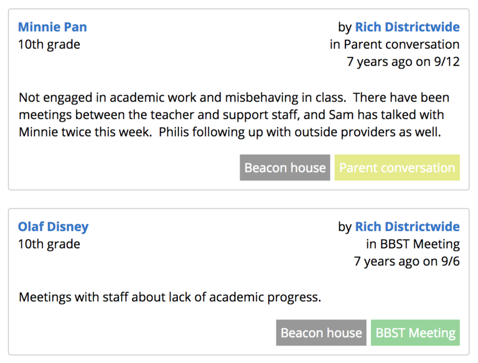



# Our work
Our work on Student Insights built on work the community had done before [...OneVille, somerville-teacher-tool].  Through that journey, we found that two particular areas really resonated with the school community in Somerville.  Those have formed the core of Student Insights, that we've worked to deepen over time, and the base on which other work is built.

<h2 class="Section-title">Student-centered profile</h2>

  

    

      
"We want to understand young people as whole, not broken on the way in, and we want schooling and education to help keep young people whole as they continue to grow in a dynamic world."<a href="todo.html" style="display: block;">- Django Paris</a>

    

    

      <a href="todo.html" class="btn">More about profiles</a>
    

  

  

    
  

<h2 class="Section-title">Student-centered notes</h2>

  

    

      
"What we say shapes how adults think about and treat students, how students feel about themselves and their peers, and who gets which dollars, teachers, daily supports, and opportunities to learn."<a style="display: block;" href="http://neatoday.org/2017/03/23/mica-pollock-schooltalk">- Mica Pollock</a>

    

    

      <a href="todo.html" class="btn">More about notes</a>
    

  

  

    
  

<h2 class="Section-title">Privacy and access control</h2>
...

<h2 class="Section-title">Attendance</h2>
...

<h2 class="Section-title">High school grades</h2>
...

<h2 class="Section-title">Class lists</h2>
...

<h2 class="Section-title">Systems of Supports</h2>
...