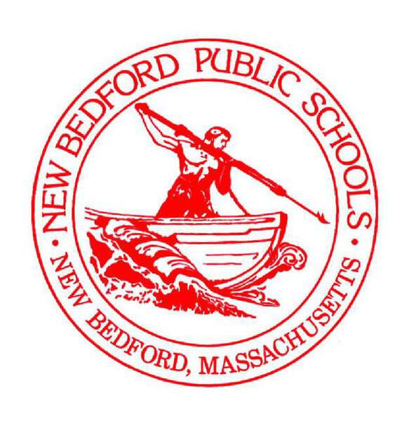



# School partnerships
Student Insights started in Somerville, MA.  We've worked with all schools in the district, and partnered with schools in two other districts: New Bedford and Bedford.  If you'd like to talk about working with us, please email anytime.

  

  

  

### What partnership means
Working with school communities means being open to what they need, and helping them adapt quickly rather than getting locked in to the software we build together, as so often happens with technology vendors.  This means we typically start the conversation in two directions: what opportunities we can see together, and what values or problems we most care about working on.

We also recognize that many educators bring strengths in data analysis, and can make sophisticated use of tools like spreadsheets, macros, surveys, LMS systems, and other new standalone tools.  Within those strengths, we seek to find ways where purpose-built software can add value beyond what educators can create on their own.  This can mean finding ways to help teacher leaders spread practices across their school or department or district, or using software tools to help encourage conversations and growth that is already happening in other ways, like reflecting on how we talk about young people.

### How to get started
We'll typically start collaborations by talking about these kinds of goals:  This is great, showing people how we work, how we get started….

- knowing what's going on with students
- seeing students in the best light and through their own eyes
- adapting the supports we provide students
- getting to root causes and problem solving

If there's a place where we all see a way to improve opportunity for young people, we'll collaborate on it.  Read more about some things we've worked with school communities on, where we're tried to help promote the hard work of improving the school community.

### Our approach to growth
When we start working with a new district, one of the places we start the conversation is focusing on how our partnership will create more opportunities and help young people.  Within that, here are a few principles around growth and adoption that have come up in our work so far:

- start within existing support structures
- focus on quality and practice, not quantity or scale
- slow sustainable growth is the best growth
- forcing things usually doesn't work; ask why instead

<a href="our-work.html" class="btn">More about our work</a>

