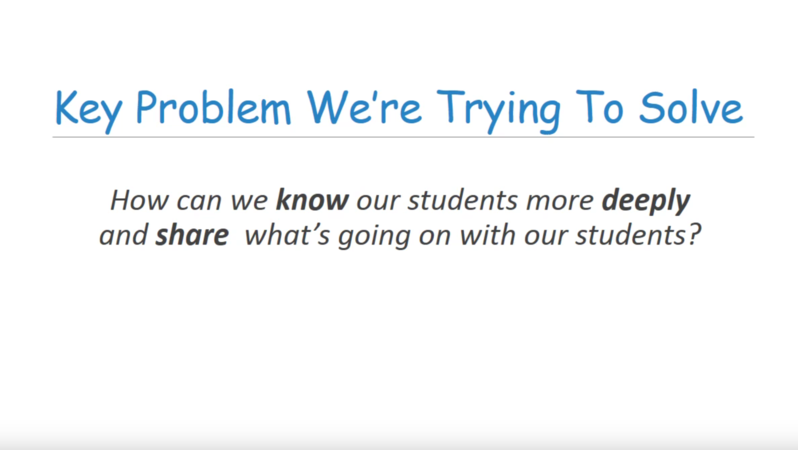
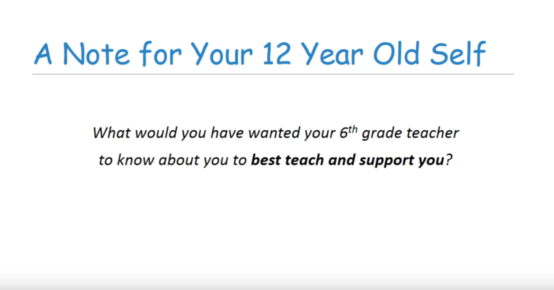
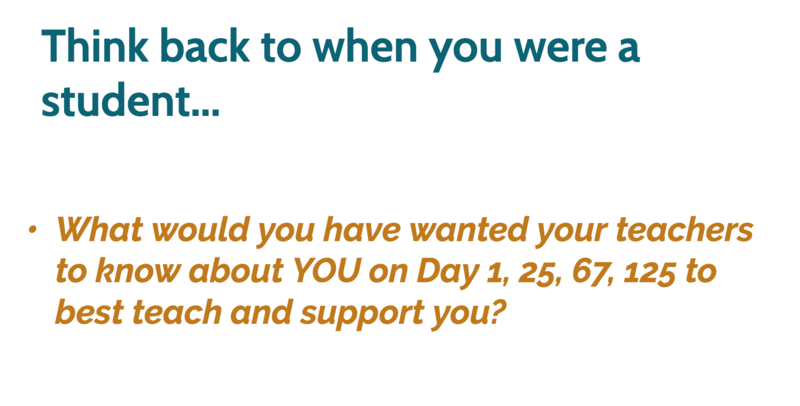
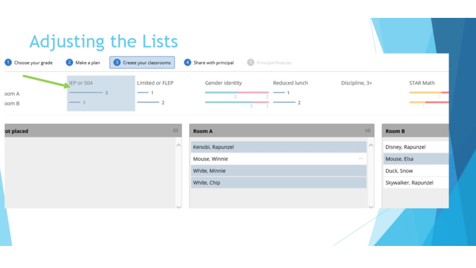



# Training and Videos
As we've built Student Insights, we've created different training materials ourselves to start.  We also have collaborated with educators so they can create trainings in ways that make sense for their particular school, department or district.

  <a target="_blank" rel="noopener noreferrer" href="https://drive.google.com/file/d/1nsGgK7qIfFbX81B_nRE6ivhnezk1kEhX/view" style="display: block; flex: 1; margin-right: 30px;">
    
    
Student Insights: Basics and Navigation video

  </a>
  <a target="_blank" rel="noopener noreferrer" href="https://drive.google.com/drive/folders/1kfjw-mOfdLzgbaDjns-4zqm-FRsFCwyT" style="display: block; flex: 1;">
    
    
Student Insights: Notes training video

  </a>

  <a target="_blank" rel="noopener noreferrer" href="https://docs.google.com/presentation/d/1UoLcd7zn2PqFnBSWipS2VKwrCtS1BJ5xEHOCcKQB7bg/view" style="display: block; flex: 1; margin-right: 30px;">
    
    
Student Insights Training slides

  </a>
  <a target="_blank" rel="noopener noreferrer" href="https://drive.google.com/open?id=1Y_BYLTc2-JaLqLOjM742tRc635xgS1eq" style="display: block; flex: 1;">
    
    
Class List Maker video

  </a>

### Documentation
- [Student Insights: Roles and Permissions](https://docs.google.com/document/d/1THekg_5gFdm5dIHANJgcoxEajlH4UjL4U0-nYJjI2WY/edit?usp=drive_web&ouid=114364589315833815880)

